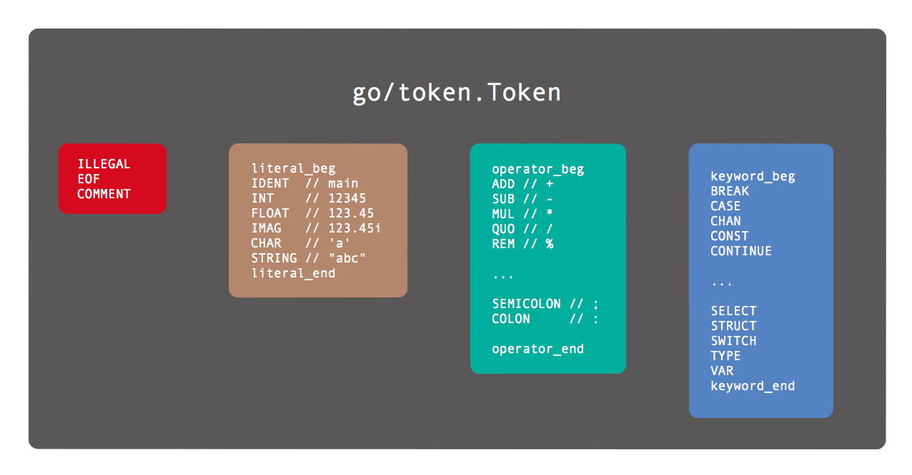
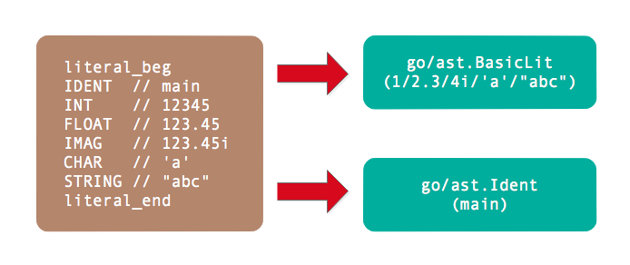
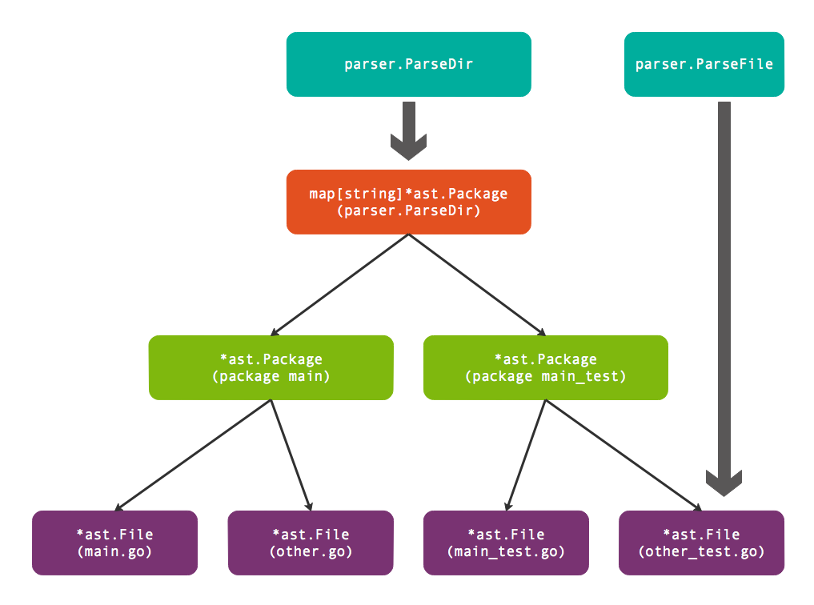
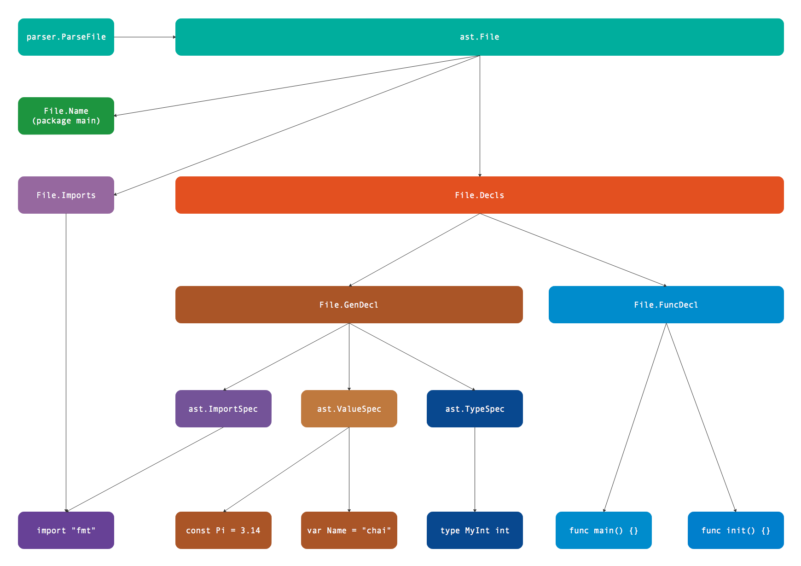
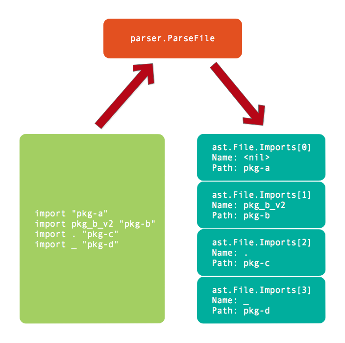
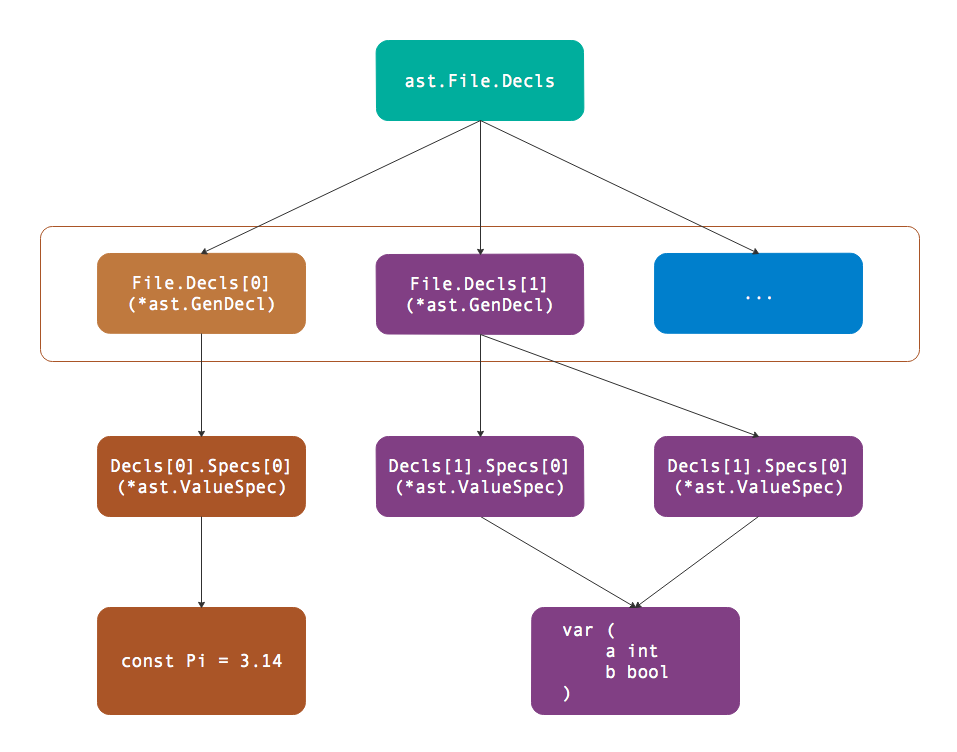

# 版权
All rights go to [author](https://github.com/chai2010/go-ast-book/). Here is just a reference & reorganization.


# 第1章 Token

Token是编程语言中最小的具有独立含义的词法单元。Token不仅仅包含关键字，还包含用户自定义的标识符、运算符、分隔符和注释等。每个Token对应的词法单元有三个属性是比较重要的：首先是Token本身的值表示词法单元的类型，其次是Token在源代码中源代码文本形式，最后是Token出现的位置。在所有的Token中，注释和分号是两种比较特殊的Token：普通的注释一般不影响程序的语义，因此很多时候可以忽略注释；而Go语言中经常在行尾自动添加分号Token，而分号是分隔语句的词法单元，因此自动添加分号导致了Go语言左花括弧不能单独一行等细微的语法差异。本章学习如何对源代码进行Token分析。

## 1.1 Token语法

Go语言中主要有标识符、关键字、运算符和分隔符等类型等Token组成。其中标识符的语法定义如下：

```bnf
identifier = letter { letter | unicode_digit } .
letter     = unicode_letter | "_" .
```

其中identifier表示标识符，由字母和数字组成，开头第一个字符必须是字母。需要注意的是下划线也是作为字母，因此可以用下划线作为标识符。不过美元符号`$`并不属于字母，因此标识符中不能包含美元符号。

在标识符中有一类特殊的标识符被定义为关键字。关键字用于引导特殊的语法结构，不能将关键字作为独立的标识符（）。下面是Go语言定义的25个关键字：

```go
break        default      func         interface    select
case         defer        go           map          struct
chan         else         goto         package      switch
const        fallthrough  if           range        type
continue     for          import       return       var
```

除了标识符和关键字，Token还包含运算符和分隔符。下面是Go语言定义的47个符号：

```
+    &     +=    &=     &&    ==    !=    (    )
-    |     -=    |=     ||    <     <=    [    ]
*    ^     *=    ^=     <-    >     >=    {    }
/    <<    /=    <<=    ++    =     :=    ,    ;
%    >>    %=    >>=    --    !     ...   .    :
     &^          &^=
```

当然，除了用户自定义的标识符、25个关键字、47个运算和分隔符号，程序中还有一些面值、注释和空白符组成。要解析一个Go语言程序，第一步就是要解析这些Token。

## 1.2 Token的定义

在`go/token`包中，Token被定义为一种枚举值，不同值的Token表示不同类型的词法记号：

```go
// Token is the set of lexical tokens of the Go programming language.
type Token int
```

所有的Token被分为四类：特殊类型的Token、基础面值对应的Token、运算符Token和关键字。



特殊类型的Token有错误、文件结束和注释三种：

```go
// The list of tokens.
const (
	// Special tokens
	ILLEGAL Token = iota
	EOF
	COMMENT
```

遇到不能识别的Token统一返回ILLEGAL，这样可以简化词法分析时的错误处理。

然后是基础面值对应的Token类型：Go语言规范定义的基础面值主要有整数、浮点数和复数面值类型，此外还有字符和字符串面值类型。需要注意的是，在Go语言规范中布尔类型的true和false并不在基础面值之类。但是为了方便词法解析，`go/token`包将true和false等对应的标识符也作为面值Token一类。

下面是面值类Token列表：

```go
	literal_beg
	// Identifiers and basic type literals
	// (these tokens stand for classes of literals)
	IDENT  // main
	INT    // 12345
	FLOAT  // 123.45
	IMAG   // 123.45i
	CHAR   // 'a'
	STRING // "abc"
	literal_end
```

其中literal_beg和literal_end是私有的类型，主要用于表示面值类型Token的值域范围，因此判断一个Token的值在literal_beg和literal_end之间就可以确定是面值类型。

运算符和分隔符符类型的Token数量最多，下面Token列表：

```go
	operator_beg
	// Operators and delimiters
	ADD // +
	SUB // -
	MUL // *
	QUO // /
	REM // %

	AND     // &
	OR      // |
	XOR     // ^
	SHL     // <<
	SHR     // >>
	AND_NOT // &^

	ADD_ASSIGN // +=
	SUB_ASSIGN // -=
	MUL_ASSIGN // *=
	QUO_ASSIGN // /=
	REM_ASSIGN // %=

	AND_ASSIGN     // &=
	OR_ASSIGN      // |=
	XOR_ASSIGN     // ^=
	SHL_ASSIGN     // <<=
	SHR_ASSIGN     // >>=
	AND_NOT_ASSIGN // &^=

	LAND  // &&
	LOR   // ||
	ARROW // <-
	INC   // ++
	DEC   // --

	EQL    // ==
	LSS    // <
	GTR    // >
	ASSIGN // =
	NOT    // !

	NEQ      // !=
	LEQ      // <=
	GEQ      // >=
	DEFINE   // :=
	ELLIPSIS // ...

	LPAREN // (
	LBRACK // [
	LBRACE // {
	COMMA  // ,
	PERIOD // .

	RPAREN    // )
	RBRACK    // ]
	RBRACE    // }
	SEMICOLON // ;
	COLON     // :
	operator_end
```

运算符主要有普通的加减乘除等算术运算符号，此外还有逻辑运算、位运算符和比较运算等二元运算（其中二元运算还和赋值运算再次组合）。除了二元运算之外，还有少量的一元运算符号：比如正负号、取地址符号、管道的读取等。而分隔符主要是小括弧、中括弧、大括弧，以及逗号、点号、分号和冒号组成。

而Go语言的关键字刚好对应25个关键字类型的Token：

```
	keyword_beg
	// Keywords
	BREAK
	CASE
	CHAN
	CONST
	CONTINUE

	DEFAULT
	DEFER
	ELSE
	FALLTHROUGH
	FOR

	FUNC
	GO
	GOTO
	IF
	IMPORT

	INTERFACE
	MAP
	PACKAGE
	RANGE
	RETURN

	SELECT
	STRUCT
	SWITCH
	TYPE
	VAR
	keyword_end
)
```

从词法分析角度看，关键字和普通的标识符并无差别。但是25个关键字一般都是不同语法结构的开头Token，通过将这些特殊的Token定义为关键字可以简化语法解析的工作。

Token对于编程语言而言就像26个字母对于英文一样重要，它是组成更复杂的逻辑代码的基础单元，因此我们需要熟悉Token的特性和分类。

## 1.3 FileSet和File

在定义Token之后，其实我们可以通过手工方式对源代码进行简单的词法分析了。不过如果希望以后能够复用词法分析的代码，则需要小心设计和源代码部分相关的接口。参考Go语言本身，它是由多个文件组成包，然后多个包链接为一个可执行文件，所以单个包对应的多个文件可以看作是Go语言的基本编译单元。因此`go/token`包还定义了FileSet和File对象，用于描述文件集和文件。

FileSet和File对象的对应关系如图所示：


每个FileSet表示一个文件集合，底层抽象为一个一维数组，而Pos类型表示数组的下标位置。FileSet中的每个File元素对应底层数组的一个区间，不同的File之间没有交集，相邻的File之间可能存在填充空间。

而每个File主要由文件名、base和size三个信息组成。其中base对应File在FileSet中的Pos索引位置，因此base和base+size定义了File在FileSet数组中的开始和结束位置。在每个File内部可以通过offset定位下标索引，通过offset+File.base可以将File内部的offset转换为Pos位置。因为Pos是FileSet的全局偏移量，反之也可以通过Pos查询对应的File，以及对应File内部的offset。

而词法分析的每个Token位置信息就是由Pos定义，通过Pos和对应的FileSet可以轻松查询到对应的File。然后在通过File对应的源文件和offset计算出对应的行号和列号（实现中File只是保存了每行的开始位置，并没有包含原始的源代码数据）。Pos底层是int类型，它和指针的语义类似，因此0也类似空指针被定义为NoPos，表示无效的Pos。

## 1.4 解析Token

Go语言标准库`go/scanner`包提供了Scanner实现Token扫描，它是在FileSet和File抽象文件集合基础上进行词法分析。

scanner.Scanner的公开接口定义如下：

```go
type Scanner struct {
	// public state - ok to modify
	ErrorCount int // number of errors encountered
	// Has unexported fields.
}

func (s *Scanner) Init(
	file *token.File, src []byte,
	err ErrorHandler, mode Mode,
)
func (s *Scanner) Scan() (
	pos token.Pos, tok token.Token, lit string,
)
```

Init方法用于初始化扫描器，其中file参数表示当前的文件（不包含代码数据），src参数表示要分析的代码，err是用户自定义的错误处理函数，mode可以控制是否扫描注释部分。

Scan方法扫描一个Token，三个返回值分别表示Token的位置
、Token值和Token的源代码文本表示。

要构造一个最简单的词法扫描器测试程序，首先要构造Init方法第一参数需要的File对象。但是File对象没有公开的构造函数，只能通过FileSet的AddFile方法间接构造File对象。

下面是一个简单的词法分析程序：

```go
package main

import (
	"fmt"
	"go/scanner"
	"go/token"
)

func main() {
	var src = []byte(`println("你好，世界")`)

	var fset = token.NewFileSet()
	var file = fset.AddFile("hello.go", fset.Base(), len(src))

	var s scanner.Scanner
	s.Init(file, src, nil, scanner.ScanComments)

	for {
		pos, tok, lit := s.Scan()
		if tok == token.EOF {
			break
		}
		fmt.Printf("%s\t%s\t%q\n", fset.Position(pos), tok, lit)
	}
}
```

其中src是要分析的代码。然后通过`token.NewFileSet()`创建一个文件集，Token的位置信息必须通过文件集定位，并且需要通过文件集创建扫描器的Init方法需要的File参数。

然后的`fset.AddFile`方法调用向fset文件集添加一个新的文件，文件名为“hello.go”，文件的长度就是src要分析代码的长度。

然后创建scanner.Scanner对象，并且调用Init方法初始化扫描器。Init的第一个参数就是刚刚添加到fset的文件对象，第二个参数是要分析的代码，第三个nil参数表示没有自定义的错误处理函数，最后的scanner.ScanComments参数表示不用忽略注释Token。

因为要解析的代码中有多个Token，因此我们在一个for循环调用`s.Scan()`依次解析新的Token。如果返回的是token.EOF表示扫描到了文件末尾，否则打印扫描返回的结果。打印前，我们需要将扫描器返回的pos参数转换为更详细的带文件名和行列号的位置信息，可以通过`fset.Position(pos)`方法完成。

以上程序运行的输出如下：

```
hello.go:1:1    IDENT   "println"
hello.go:1:8    (       ""
hello.go:1:9    STRING  "\"你好，世界\""
hello.go:1:26   )       ""
hello.go:1:27   ;       "\n"
```

输出结果的第一列表示Token所在的文件和行列号，中间一列表示Token的值，最后一列表示Token对应的面值。

## 1.5 Position位置信息

`go/token`包的Position表示更详细的位置信息，被定义为一个结构体：

```go
type Position struct {
	Filename string // filename, if any
	Offset   int    // offset, starting at 0
	Line     int    // line number, starting at 1
	Column   int    // column number, starting at 1 (byte count)
}
```

Filename表示文件名，Offset对应文件内的字节偏移量（从0开始），Line和Column对应行列号（从1开始）。比较特殊的是Offset成员，它用于从文件数据定位代码，但是输出时会将偏移量转换为行列号输出。

打印位置信息时，根据文件名、行号和列号有6种组合：

```go
func main() {
	a := token.Position{Filename: "hello.go", Line: 1, Column: 2}
	b := token.Position{Filename: "hello.go", Line: 1}
	c := token.Position{Filename: "hello.go"}

	d := token.Position{Line: 1, Column: 2}
	e := token.Position{Line: 1}
	f := token.Position{Column: 2}

	fmt.Println(a.String())
	fmt.Println(b.String())
	fmt.Println(c.String())
	fmt.Println(d.String())
	fmt.Println(e.String())
	fmt.Println(f.String())
}
```

输出的格式如下：

```
hello.go:1:2
hello.go:1
hello.go
1:2
1
-
```

行号从1开始，是必须的信息，如果缺少行号则输出“-”表示无效的位置。

# 第2章 基础面值

面值是在程序代码中直接表示的值，其它的非零初始值只能由面值常量或常量表达式生成。比如表达式`x+2*y`的`2`就是面值，而`x`和`y`则不是面值而是标识符。Go语言规范明确定义了基础面值只有整数、浮点数、复数、符文和字符串几种类型。需要特别注意的是布尔类型的true和false并不是普通的面值，而是内置的布尔类型标识符（可能被重新定义为其它变量）。但是从Go语言用户角度看，true和false也是预定义的面值类型，因此普通的标识符也被归在面值一类（在`literal_beg`和`literal_end`之间）。

## 2.1 基础面值定义

基础面值有整数、浮点数、复数、字符和字符串几种类型，同时标识符也作为面值类型。在`go/token`包中，基础面值也被定义为独立的Token：



其中没有导出的`literal_beg`和`literal_end`之间的Token都是基础面值类型。

其中整数型面值定义如下：

```
int_lit        = decimal_lit | binary_lit | octal_lit | hex_lit .
decimal_lit    = "0" | ( "1" … "9" ) [ [ "_" ] decimal_digits ] .
binary_lit     = "0" ( "b" | "B" ) [ "_" ] binary_digits .
octal_lit      = "0" [ "o" | "O" ] [ "_" ] octal_digits .
hex_lit        = "0" ( "x" | "X" ) [ "_" ] hex_digits .
```

整数型面值分为十进制面值、二进制面值、八进制面值和十六进制面值四种形式。需要注意的是整数型面值并不支持科学计数法形式，同时数字中间可以添加下划线分隔数字。

数值类型的面值中除了整数之外就是浮点数面值。浮点数面值又分为十进制浮点数和十六进制浮点数，它们的语法定义如下：

```
float_lit         = decimal_float_lit | hex_float_lit .

decimal_float_lit = decimal_digits "." [ decimal_digits ] [ decimal_exponent ] |
                    decimal_digits decimal_exponent |
                    "." decimal_digits [ decimal_exponent ] .
decimal_exponent  = ( "e" | "E" ) [ "+" | "-" ] decimal_digits .

hex_float_lit     = "0" ( "x" | "X" ) hex_mantissa hex_exponent .
hex_mantissa      = [ "_" ] hex_digits "." [ hex_digits ] |
                    [ "_" ] hex_digits |
                    "." hex_digits .
hex_exponent      = ( "p" | "P" ) [ "+" | "-" ] decimal_digits .
```

其中decimal_float_lit表示十进制浮点数，又有普通十进制和科学计数法两种表示形式。而科学计数法形式的面值中不仅仅有十进制形式，还有十六进制科学计数法形式。十六进制浮点数在C语言的C99标准就已经存在，而C++的C++17版本开始支持，Java等语言也已经支持，而Go语言是在Go1.13开始支持。十六进制浮点数的优势是可以完美配合IEEE754定义的二进制指数的浮点数表达，可以尽量包装浮点数面值和浮点数变量的值精确一致。

除了整数和浮点数之外，数值型面值还包含复数类型：

```
imaginary_lit = (decimal_digits | int_lit | float_lit) "i" .
```

复数面值的定义比较简单，它是在整数或浮点数面值增加一个`i`后缀。比如`0i`和`123i`就分别将0和123转为复数形式。

除了数值型面值之外，还有字符面值和字符串面值，它们的定义如下：

```
rune_lit         = "'" ( unicode_value | byte_value ) "'" .
unicode_value    = unicode_char | little_u_value | big_u_value | escaped_char .
byte_value       = octal_byte_value | hex_byte_value .

string_lit             = raw_string_lit | interpreted_string_lit .
raw_string_lit         = "`" { unicode_char | newline } "`" .
interpreted_string_lit = `"` { unicode_value | byte_value } `"`
```

字符面值类似一个只有一个字符的字符串，由一对单引号包含。而字符串由一对双引号或反引号表示，其中可以包含多个字符，但是不能跨行。普通的字符和字符串都可以通过转义字符包含特殊的符号，它们是通过一个特殊的`\`斜杠开始。而反引号表示的字符串表示原生字符串，原生字符串可以跨域多行但是不支持转义字符，因此其内部是无法表示反引号这个字符的。


## 2.2 基础面值语法树结构

Go语言的抽象语法树由`go/ast`包定义。其中`ast.BasicLit`表示一个基础类型的面值常量结构，它的定义如下：

```go
type BasicLit struct {
	ValuePos token.Pos   // literal position
	Kind     token.Token // token.INT, token.FLOAT, token.IMAG, token.CHAR, or token.STRING
	Value    string      // literal string; e.g. 42, 0x7f, 3.14, 1e-9, 2.4i, 'a', '\x7f', "foo" or `\m\n\o`
}
```

其中ValuePos成员表示该词法元素开始的字节偏移量（并不包含文件名、行号和列号等信息），Kind表示面值的类型（只有数值类型、字符和字符串三类），最后的Value是表示面值的原始代码。

## 2.3 构造面值

在了解了基础面值的语法树结构之后，我们可以手工构造简单的基础面值。比如下面的代码构造一个整数9527的面值：

```go
package main

import (
	"go/ast"
	"go/token"
)

func main() {
	var lit9527 = &ast.BasicLit{
		Kind:  token.INT,
		Value: "9527",
	}
	ast.Print(nil, lit9527)
}
```

其中`token.INT`表示基础面值的类型是整数，值是整数的十进制字符串表示。如果把`token.INT`改为`token.FLOAT`则变成浮点数的9527，如果改成`token.STRING`则会变成“9527”字符串面值。

## 2.4 解析基础面值

在前面的例子中，我们通过`ast.BasicLit`结构直接构造了面值。通过手工的方式直接构造`ast.BasicLit`甚至是完整的语法树都是可以的，从理论上说可以为任何Go语言程序手工构造等价的语法树结构。但是纯手工方式构造语法树毕竟太繁琐，还好Go语言的`go/parser`可以帮我们解析Go语言代码并自动构造语法树。

下面的例子是通过`parser.ParseExpr`函数从十进制的9527生成`ast.BasicLit`结构：

```go
func main() {
	expr, _ := parser.ParseExpr(`9527`)
	ast.Print(nil, expr)
}
```

`go/parser`包提供了`parser.ParseExpr`函数用于简化表达式的解析。返回`ast.Expr`类型的`expr`和一个错误，`expr`表示表达式的语法树。然后通过`go/ast`包提供的`ast.Print`函数打印语法树。

输出结果如下：

```go
0  *ast.BasicLit {
1  .  ValuePos: 1
2  .  Kind: INT
3  .  Value: "9527"
4  }
```

也可以解析“9527”字符串面值：

```go
func main() {
	expr, _ := parser.ParseExpr(`"9527"`)
	ast.Print(nil, expr)
}
```

输出的字符串面值的原始表达文本：

```go
0  *ast.BasicLit {
1  .  ValuePos: 1
2  .  Kind: STRING
3  .  Value: "\"9527\""
4  }
```

基础面值在语法树中是属于叶子结点的存在，在递归遍历语法树时遇到基础面值结点递归就会返回。同时，通过基础面值、指针、结构体、数组和map等其它语法结构的相互嵌套和组合就可以构造出无穷无尽的复杂类型来。

## 2.5 标识符面值

`go/ast`包同样定义了Ident结构体，表示标识符类型：

```go
type Ident struct {
	NamePos token.Pos // identifier position
	Name    string    // identifier name
	Obj     *Object   // denoted object; or nil
}
```

NamePos表示标识符的位置，Name是标识符的名字，Obj则表示标识符的类型获取其它的扩展信息。作为内置的标识符面值来说，我们主要关注标识符的名字即可。

`go/ast`包同时提供了`NewIdent`函数用于创建简单的标识符：

```go
func main() {
	ast.Print(nil, ast.NewIdent(`x`))
}
```

输出的结果如下：

```
0  *ast.Ident {
1  .  NamePos: 0
2  .  Name: "x"
3  }
```

如果是从表达式解析标识符，则会通过Obj成员描述标识符额外的信息：

```go
func main() {
	expr, _ := parser.ParseExpr(`x`)
	ast.Print(nil, expr)
}
```

输出表达式中x标识符信息如下：

```go
0  *ast.Ident {
1  .  NamePos: 1
2  .  Name: "x"
3  .  Obj: *ast.Object {
4  .  .  Kind: bad
5  .  .  Name: ""
6  .  }
7  }
```

`ast.Object`是一个相对复杂的结构，其中Kind用于描述标识符的类型：

```go
const (
    Bad ObjKind = iota // for error handling
    Pkg                // package
    Con                // constant
    Typ                // type
    Var                // variable
    Fun                // function or method
    Lbl                // label
)
```

Bad表示未知的类型，其它的分别对应Go语言中包、常量、类型、变量、函数和标号等语法结构。而对于标识符中更具体的类型（比如是整数还是布尔类型）则是由`ast.Object`的其它成员描述。

# 第3章 基础表达式

为了简化代码，我们从基础表达式开始。基础表达式是指完全由数值型面值和标识符组成的表达式。

## 3.1 基础表达式语法

基础表达式主要是指由一元和二元运算符组成的表达式，运算的主体是各种面值或标识符。基础表达式语法如下：

```
Expression = UnaryExpr | Expression binary_op Expression .
UnaryExpr  = Operand | unary_op UnaryExpr .
Operand    = Literal | identifier | "(" Expression ")" .

binary_op  = "||" | "&&" | rel_op | add_op | mul_op .
rel_op     = "==" | "!=" | "<" | "<=" | ">" | ">=" .
add_op     = "+" | "-" | "|" | "^" .
mul_op     = "*" | "/" | "%" | "<<" | ">>" | "&" | "&^" .

unary_op   = "+" | "-" | "!" | "^" | "*" | "&" | "<-" .
```

其中Expression表示基础表达式的递归定义，可以是UnaryExpr类型的一元表达式，或者是binary_op生成的二元表达式。而基础表达式运算符两边的对象由Operand定义，主要是面值或表达式，也可以是由小括弧包含的表达式。


## 3.2 解析表达式

`parser.ParseExpr`函数是解析的单个表达式（可以包含注释），因此返回的`ast.Expr`是一个表达式抽象接口：

```go
type Expr interface {
    Node
    // contains filtered or unexported methods
}
```

除了内置一个`ast.Node`接口之外没有任何其它信息和约束（这是Go语言隐式接口的缺点，用户需要自己猜测接口之间的逻辑关系）。

而`ast.Node`接口更简单，只有两个方法表示了这个语法树结点的开始位置和结束位置：

```go
type Node interface {
    Pos() token.Pos // position of first character belonging to the node
    End() token.Pos // position of first character immediately after the node
}
```

通过分析`go/ast`包的文档可以发现很多类型以`Expr`为后缀名：

```bash
$ go doc go/ast | grep Expr
type BadExpr struct{ ... }
type BinaryExpr struct{ ... }
type CallExpr struct{ ... }
type Expr interface{ ... }
type ExprStmt struct{ ... }
type IndexExpr struct{ ... }
type KeyValueExpr struct{ ... }
type ParenExpr struct{ ... }
type SelectorExpr struct{ ... }
type SliceExpr struct{ ... }
type StarExpr struct{ ... }
type TypeAssertExpr struct{ ... }
type UnaryExpr struct{ ... }
```

真实的表达式种类当然并不仅仅是这些，起码前面例子中的`ast.BasicLit`类型不在其中，不过目前我们并不需要`Expr`的全部类型列表。

我们以`ast.BinaryExpr`表达的二元算术表达式开始，因为加减乘除四则运算是我们最熟悉的表达式结构：

```go
func main() {
	expr, _ := parser.ParseExpr(`1+2*3`)
	ast.Print(nil, expr)
}
```

输出的结果如下：

```bash
 0  *ast.BinaryExpr {
 1  .  X: *ast.BasicLit {
 2  .  .  ValuePos: 1
 3  .  .  Kind: INT
 4  .  .  Value: "1"
 5  .  }
 6  .  OpPos: 2
 7  .  Op: +
 8  .  Y: *ast.BinaryExpr {
 9  .  .  X: *ast.BasicLit {
10  .  .  .  ValuePos: 3
11  .  .  .  Kind: INT
12  .  .  .  Value: "2"
13  .  .  }
14  .  .  OpPos: 4
15  .  .  Op: *
16  .  .  Y: *ast.BasicLit {
17  .  .  .  ValuePos: 5
18  .  .  .  Kind: INT
19  .  .  .  Value: "3"
20  .  .  }
21  .  }
22  }
```

下图是`parser.ParseExpr("1+2*3")`返回的树结构：


其中`ast.BasicLit`是基础面值类型，在前面章节已经讲过。而`ast.BinaryExpr`是表示二元表达式的结点，其定义如下：

```go
type BinaryExpr struct {
    X     Expr        // left operand
    OpPos token.Pos   // position of Op
    Op    token.Token // operator
    Y     Expr        // right operand
}
```

 其中Op成员表示二元运算符，而X和Y成员则对应运算符左右两个操作数。最重要的是，X和Y操作数都是`Expr`接口类型，这就可以构成递归定义！因此在输出的结果中，最外层的Y部分被填充为`*ast.BinaryExpr`类型的子语法树（这说明后出现的乘法有着更高的优先级）。

## 3.3 求值表达式

在了解了`ast.BinaryExpr`语法树的结构之后，其实我们就可以手工对表达式求值了：

```go
func main() {
	expr, _ := parser.ParseExpr(`1+2*3`)
	fmt.Println(Eval(expr))
}

func Eval(exp ast.Expr) float64 {
	switch exp := exp.(type) {
	case *ast.BinaryExpr:
		return EvalBinaryExpr(exp)
	case *ast.BasicLit:
		f, _ := strconv.ParseFloat(exp.Value, 64)
		return f
	}
	return 0
}

func EvalBinaryExpr(exp *ast.BinaryExpr) float64 {
	switch exp.Op {
	case token.ADD:
		return Eval(exp.X) + Eval(exp.Y)
	case token.MUL:
		return Eval(exp.X) * Eval(exp.Y)
	}
	return 0
}
```

其中Eval函数用于递归解析表达式，如果是二元表达式`*ast.BinaryExpr`类型则调用EvalBinaryExpr进行解析，如果是`*ast.BasicLit`面值类型则直接用`strconv.ParseFloat`解析浮点数面值。EvalBinaryExpr函数用于解析二元表达式，这里为了简单只展示的加法和乘法类型的运算符，然后在加法或乘法的左右子表达式中再调用Eval解析。

Go语言中，表达式是所有运算的基础。很多功能性的函数也可以作为表达式的一个部分参与运算。如果表达式中再引入变量和函数就变得异常强大了。


## 3.4 标识符：为表达式中引入变量

在前面的例子中，我们已经尝试过数值类型的常量构成的表达式求值。我们现在尝试为表达式引入变量，变量由外部动态注入。

还是先从一个简单的例子入手：

```go
func main() {
    expr, _ := parser.ParseExpr(`x`)
    ast.Print(nil, expr)
}
```

输出结果如下：

```
0  *ast.Ident {
1  .  NamePos: 1
2  .  Name: "x"
3  .  Obj: *ast.Object {
4  .  .  Kind: bad
5  .  .  Name: ""
6  .  }
7  }
```

表达式只有一个`x`，对应`*ast.Ident`类型。`*ast.Ident`类型的定义如下：

```go
type Ident struct {
    NamePos token.Pos // identifier position
    Name    string    // identifier name
    Obj     *Object   // denoted object; or nil
}
```

其中最重要的是`Name`成员，表示标识符的名字。这样我们就可以在递归解析时传入一个上下文参数，其中包含变量的值：

```go
func main() {
	expr, _ := parser.ParseExpr(`1+2*3+x`)
	fmt.Println(Eval(expr, map[string]float64{
		"x": 100,
	}))
}

func Eval(exp ast.Expr, vars map[string]float64) float64 {
	switch exp := exp.(type) {
	case *ast.BinaryExpr:
		return EvalBinaryExpr(exp, vars)
	case *ast.BasicLit:
		f, _ := strconv.ParseFloat(exp.Value, 64)
		return f
	case *ast.Ident:
		return vars[exp.Name]
	}
	return 0
}

func EvalBinaryExpr(exp *ast.BinaryExpr, vars map[string]float64) float64 {
	switch exp.Op {
	case token.ADD:
		return Eval(exp.X, vars) + Eval(exp.Y, vars)
	case token.MUL:
		return Eval(exp.X, vars) * Eval(exp.Y, vars)
	}
	return 0
}
```

在Eval函数递归解析时，如果当前解析的表达式语法树结点是`*ast.Ident`类型，则直接从`vars`表格查询结果。

不过在Go语言的表达式要复杂很多，不仅仅有普通的局部变量，还有数组索引求值、管道取值、其它结构的成员求值等类型。但是标识符是引入变量最基础的方法，我们可以在此基础方法之上慢慢完善更复杂的求值函数。

# 第4章 代码结构

前文我们已经简单了解如何解析单个表达式。但是Go语言的表达式不是独立存在的语法结构，如果我们希望通过表达式和赋值语句来更新上下文环境，那么就需要将表达式放到Go语言源文件环境进行解析。Go语言的代码结构主要分为三个层面：目录结构、目录内部的包结构、文件内部的代码结构。标准库的`go/parser`包只提供了目录和文件解析的函数，因此我们主要从这两个函数学习和语法树相关的代码结构。

## 4.1 目录结构

Go语言代码根据目录组织，一个包由多个文件组织，文件必须属于同一个目录下。不过包的单元测试虽然也和包的普通代码文件属于同一个目录，但是测试代码可以属于一个独立的测试包（独立的测试包名是以`_test`为后缀）。标准库`go/parser`包中的`parser.ParseDir`用于解析目录内的全部Go语言文件，返回的`map[string]*ast.Package`包含多个包信息。而`parser.ParseFile`用于解析单个文件，返回的`*ast.File`包含文件内部代码信息。而每个`*ast.Package`正是由多个`*ast.File`文件组成。它们直接的逻辑关系如下图所示：



图中展示的测试包由`main.go`、`other.go`、`main_test.go`、`other_test.go`四个文件组成，其中`main.go`、`other.go`两个文件属于`package main`包，而`main_test.go`、`other_test.go`两个文件属于`package main_test`测试包。因此`parser.ParseDir`解析出两个包，每个包中各有两个文件。当然，我们也可以针对每个文件手工调用`parser.ParseFile`函数进行解析，然后根据包的名字输出类似`parser.ParseDir`的结果。

因为`parser.ParseDir`的实际的代码实现也是由`parser.ParseFile`函数简单包装而来，因此我们只要简单了解目录结构即可，文件内部的代码结构才是Go语法树解析的难点和要点。

## 4.2 文件结构

Go语言是一个精心设计的语言，语法非常利于理解和解析。一个Go语言文件中，顶级的语法元素只有package、import、type、const、var和func这几种。每个文件的语法规范定义如下：

```
SourceFile    = PackageClause ";" { ImportDecl ";" } { TopLevelDecl ";" } .

PackageClause = "package" PackageName .
PackageName   = identifier .

ImportDecl    = "import" ( ImportSpec | "(" { ImportSpec ";" } ")" ) .
ImportSpec    = [ "." | PackageName ] ImportPath .
ImportPath    = string_lit .

TopLevelDecl  = Declaration | FunctionDecl | MethodDecl .
Declaration   = ConstDecl | TypeDecl | VarDecl .
```

SourceFile表示一个Go源文件，由PackageClause表示的包定义、ImportDecl表示的导入声明和TopLevelDecl表示的顶级声明三个部分组成。其中TopLevelDecl又由通用声明、函数声明和方法声明组成，通用声明再分为常量、类型和变量声明。

以下代码是一个Go源文件的例子：

```go
package pkgname

import ("a", "b")
type SomeType int
const PI = 3.14
var Length = 1

func main() {}
```

只要通过每行开头的不同关键字就可以明确属于哪种声明类型。使用`go/parser`包的`parser.ParseFile`函数就可以对上面的代码进行解析：

```go
func main() {
	fset := token.NewFileSet()
	f, err := parser.ParseFile(fset, "hello.go", src, parser.AllErrors)
	if err != nil {
		fmt.Println(err)
		return
	}

	...
}

const src = `package pkgname

import ("a"; "b")
type SomeType int
const PI = 3.14
var Length = 1

func main() {}
`
```

`parser.ParseFile`函数返回的是`*ast.File`类型的结构体：

```go
type File struct {
	Doc        *CommentGroup   // associated documentation; or nil
	Package    token.Pos       // position of "package" keyword
	Name       *Ident          // package name
	Decls      []Decl          // top-level declarations; or nil
	Scope      *Scope          // package scope (this file only)
	Imports    []*ImportSpec   // imports in this file
	Unresolved []*Ident        // unresolved identifiers in this file
	Comments   []*CommentGroup // list of all comments in the source file
}
```

结构体的`File.Name`成员表示文件对应包的名字，然后是`File.Imports`表示当前文件导入的第三方的包信息。因此通过以下代码就可以输出当前包名和导入包名字：

```go
	fmt.Println("package:", f.Name)

	for _, s := range f.Imports {
		fmt.Println("import:", s.Path.Value)
	}

	// Output:
	// package: pkgname
	// import: "a"
	// import: "b"
```

但是结构体中最重要的其实是`File.Decls`成员，它包含了当前文件全部的包级声明信息（包含导入信息）。即使没有`File.Imports`成员，我们也可以从`File.Decls`声明列表中获取全部导入包的信息。

通过以下的代码可以查看`File.Decls`每个成员的类型信息：

```go
	for _, decl := range f.Decls {
		fmt.Printf("decl: %T\n", decl)
	}

	// Output:
	// decl: *ast.GenDecl
	// decl: *ast.GenDecl
	// decl: *ast.GenDecl
	// decl: *ast.GenDecl
	// decl: *ast.FuncDecl
```

分析输出结构可以发现前四个都是`*ast.GenDecl`类型，只有最后一个是`*ast.FuncDecl`类型。因此可以推测，`import`、`type`、`const`和`type`都是对应`*ast.GenDecl`类型，只有函数是独立的`*ast.FuncDecl`类型。

因此我们也可以从`f.Decls`列表中获取导入包的信息：

```go
	for _, v := range f.Decls {
		if s, ok := v.(*ast.GenDecl); ok && s.Tok == token.IMPORT {
			for _, v := range s.Specs {
				fmt.Println("import:", v.(*ast.ImportSpec).Path.Value)
			}
		}
	}
```

在遍历`f.Decls`列表时，首先判断是否为`*ast.GenDecl`类型，如果是并且`s.Tok`是`token.IMPORT`类型则表示是导入的声明。这样我们就可以将`s.Specs`列表的每个元素作为`*ast.ImportSpec`类型进行输出。

下图是`ast.File`结构体对应的代码结构：


首先通过`parser.ParseFile`解析文件得到`*ast.File`类型的结构体。`*ast.File`结构体中Name包含了包名信息，Decls包含了全部的声明信息（声明分别对应`ast.GenDecl`和`ast.FuncDecl`两种类型），以及导入信息。

## 4.3 诊断语法树

`go/ast`包为语法树提供了`ast.Print`函数专门打印语法树：

```shell
$ go doc ast.Print
package ast // import "go/ast"

func Print(fset *token.FileSet, x interface{}) error
    Print prints x to standard output, skipping nil fields. Print(fset, x) is
    the same as Fprint(os.Stdout, fset, x, NotNilFilter).
```

这是学习和调试语法树最重要的函数，通过其输出我们可以对语法树有一个直观的印象，从而为进一步分析处理语法树奠定基础。从`ast.Print`函数文档可以看出，它是`ast.Fprint`函数的再次包装（类似`fmt.Print`和`fmt.Fprint`函数的关系），这样我们不仅仅可以定义输出的目标，还可以通过过滤函数来控制要输出的内容。

此外通过`ast.Walk`可以遍历整个语法树（和`filepath.Walk`遍历目录的思想类似）：

```go
type myNodeVisitor struct {}

func (p *myNodeVisitor) Visit(n ast.Node) (w ast.Visitor) {
	if x, ok := n.(*ast.Ident); ok {
		fmt.Println("myNodeVisitor.Visit:", x.Name)
	}
	return p
}

func main() {
	fset := token.NewFileSet()
	f, err := parser.ParseFile(fset, "hello.go", src, parser.AllErrors)
	if err != nil {
		log.Fatal(err)
		return
	}

	ast.Walk(new(myNodeVisitor), f)
}

const src = `...` // 和前面的内容相同
```

首先定义一个新的`myNodeVisitor`类型以满足`ast.Visitor`接口，然后在`myNodeVisitor.Visit`方法输出标识符类型的名字，最后通过`ast.Walk`遍历整个语法树。

输出结果如下：

```
myNodeVisitor.Visit: pkgname
myNodeVisitor.Visit: SomeType
myNodeVisitor.Visit: int
myNodeVisitor.Visit: PI
myNodeVisitor.Visit: Length
myNodeVisitor.Visit: main
```

当然，我们也可以通过`ast.Inspect`函数实现同样的功能：

```go
	ast.Inspect(f, func(n ast.Node) bool {
		if x, ok := n.(*ast.Ident); ok {
			fmt.Println("ast.Inspect", x.Name)
		}
		return true
	})
```

所以说，语法树的很多处理原理是相通的，`ast.Inspect`函数只是`ast.Walk`更简化版的包装而已。有了语法树之后，对import进行花样排序就变成了对`File.Decls`列表元素的处理问题。

## 4.5 总结

`parser.ParseDir`解析目录结构返回包含多个包的map，返回包的总体逻辑关系如下图所示：


多个包可以构成完整的可执行程序。每个包内部通过文件组织代码的导入和声明语句。而单个文件可以由`parser.ParseFile`完成解析，文件内部的逻辑关系如下图：


首先是包的名字，然后是导入的依赖包列表，最后是类型、常量、变量和函数等声明列表。而文件内部的声明列表是最复杂也是最重要的部分，其更详细的逻辑结构如下图：



声明部分包含基础声明和函数声明。基础声明包含导入声明、类型声明、常量声明和变量声明，它们可以独立声明，也可以按组方式声明，其中常量和变量的声明采用相同的结构表示。而函数声明不支持按组方式声明，函数声明主要包含接受者、函数参数和返回值组成的函数类型，以及函数的代码实现等信息。

# 第5章 通用声明

通用声明是不含函数声明的包级别声明：包含导入包、类型、常量和变量四种声明。本章我们将讨论通用声明在语法树中的表示形式。

## 5.1 导入声明

Go语言中，当package关键字成功定义一个包之后，导入语句必须在第一时间出现，然后才能是类型、常量、变量和函数等其它声明。导入包的语法如下：

```
ImportDecl  = "import" ( ImportSpec | "(" { ImportSpec ";" } ")" ) .
ImportSpec  = [ "." | PackageName ] ImportPath .
ImportPath  = string_lit .

PackageName = identifier .
```

ImportDecl定义了导入声明的完整语法，第一个出现的必须是import关键字。然后小括弧中是imprt语句之后的部分，小括弧中的竖线分隔符表示只选择其中一个（和正则表达式的语法类似），这里是`ImportSpec`（单独导入一个包）或者是`"(" { ImportSpec ";" } ")"`（按组导入包）两种形式之一。ImportSpec定义了一个包的导入方式，中括弧中的导入名字是可选择的部分，ImportPath是由字符串面值组成的导入包路径。

根据导入语法定义，创建的导入声明有以下几种形式：

```go
import "pkg-a"
import pkg_b_v2 "pkg-b"
import . "pkg-c"
import _ "pkg-d"
```

其中第一种是默认的导入方式，导入后的名字采用的是"pkg-a"包定义的名字（具体的名字由依赖包决定）。第二种是将导入的"pkg-b"重新命名为pkg_b_v2。第三种是将依赖包的公开符号直接导入到当前文件的名字空间。第四种只是导入依赖包触发其包的初始化动作，但是不导入任何符号到当前文件名字空间。导入包的名字只在当前文件空间有效，因此pkg_b_v2这个名字不会扩散到当前包的其它源文件。

以下代码是对导入声明的解析：

```go
func main() {
	fset := token.NewFileSet()
	f, err := parser.ParseFile(fset, "hello.go", src, parser.ImportsOnly)
	if err != nil {
		log.Fatal(err)
	}

	for _, s := range f.Imports {
		fmt.Printf("import: name = %v, path = %#v\n", s.Name, s.Path)
	}
}

const src = `package foo
import "pkg-a"
import pkg_b_v2 "pkg-b"
import . "pkg-c"
import _ "pkg-d"
`
```

在使用`parser.ParseFile`分析文件时，采用的是`parser.ImportsOnly`模式，这样语法分析只会解析包声明和导入包的部分，其后的类型、常量、变量和函数的声明则不会解析。然后通过`ast.File`的Imports成员获取详细的导入信息（Imports成员是根据Decls声明列表中的信息生成）。

以上程序的输出结果如下：

```
import: name = <nil>, path = &ast.BasicLit{ValuePos:20, Kind:9, Value:"\"pkg-a\""}
import: name = pkg_b_v2, path = &ast.BasicLit{ValuePos:44, Kind:9, Value:"\"pkg-b\""}
import: name = ., path = &ast.BasicLit{ValuePos:61, Kind:9, Value:"\"pkg-c\""}
import: name = _, path = &ast.BasicLit{ValuePos:78, Kind:9, Value:"\"pkg-d\""}
```

其中第一个导入语句的Name是`<nil>`，表示采用的是依赖包的名字。其后的三个导入语句的Name都和我们导入声明指定的名字一致。关于导入包内部各种对象详细的定义则需要通过加载依赖的包才能获取，而内置的一些函数则需要通过手工方式和编译工具配合。

导入语句解析之后的语法树结构如图所示：



在编译完整的程序时，我们就可以根据导入包的路径加载其信息，通过导入后的Name访问依赖包中导出的符号。

## 5.2 基础类型声明

Go语言中通过type关键字声明类型：一种是声明新的类型，另一种是为已有的类型创建一个别名。以下是类型声明的语法规范：

```
TypeDecl = "type" ( TypeSpec | "(" { TypeSpec ";" } ")" ) .
TypeSpec = AliasDecl | TypeDef .

AliasDecl = identifier "=" Type .
TypeDef   = identifier Type .
Type      = identifier | "(" Type ")" .
```

其中TypeDecl定义了类型声明的语法规范，可以是每个类型独立定义或通过小括弧包含按组定义。其中AliasDecl是定义类型的别名（名字和类型中间有个赋值符号），而TypeDef则是定义一个新的类型。而基础的Type就是由标识符或者是小括弧包含的其它类型表示。

以下代码定义了一个新的MyInt1类型，同时为int创建一个MyInt2的别名：

```go
type MyInt1 int
type MyInt2 = int
```

然后通过以下代码解析以上两个类型声明语句：

```go
func main() {
	fset := token.NewFileSet()
	f, err := parser.ParseFile(fset, "hello.go", src, parser.AllErrors)
	if err != nil {
		log.Fatal(err)
	}
	...
}

const src = `package foo
type MyInt1 int
type MyInt2 = int
`
```

返回的所有声明都在`f.Decls`列表中，而基础声明对应的是`*ast.GenDecl`类型。然后我们就可以通过以下代码，查看针对类型声明的`*ast.GenDecl.Specs`列表中每个元素的类型：

```go
	for _, decl := range f.Decls {
		if v, ok := decl.(*ast.GenDecl); ok {
			for _, spec := range v.Specs {
				fmt.Printf("%T\n", spec)
			}
		}
	}
	// Output:
	// *ast.TypeSpec
	// *ast.TypeSpec
```

经过运行测试，输出的是`*ast.TypeSpec`，对于类型声明在语法树的结点类型。`*ast.TypeSpec`的结构体定义如下：

```go
type TypeSpec struct {
	Doc     *CommentGroup // associated documentation; or nil
	Name    *Ident        // type name
	Assign  token.Pos     // position of '=', if any
	Type    Expr          // *Ident, *ParenExpr, *SelectorExpr, *StarExpr, or any of the *XxxTypes
	Comment *CommentGroup // line comments; or nil
}
```

其中最重要的是`TypeSpec.Name`成员，表示新声明类型的名字或者是已有类型的别名。而`TypeSpec.Assign`成员对应`=`符号的位置，如果该成员表示的位置有效，则表示这是为已有类型定义一个别名（而不是定义新的类型）。最后`TypeSpec.Type`表示具体的类型的表达式，标识符表达式、小括号表达式、点号选择表达式、指针表达式和类似`*ast.XxxTypes`类型，目前我们展示的是最简单的标识符表示的类型。


## 5.3 常量声明

Go语言中常量属于编译时常量，只有布尔型、数值型和字符串三种常量类型，同时常量有分为弱类型和强类型常量。常量声明的语法规范如下：

```
ConstDecl      = "const" ( ConstSpec | "(" { ConstSpec ";" } ")" ) .
ConstSpec      = IdentifierList [ [ Type ] "=" ExpressionList ] .

IdentifierList = identifier { "," identifier } .
ExpressionList = Expression { "," Expression } .
```

ConstDecl定义了常量声明的语法，同样可以单独声明每个常量也可以小括弧包含按组声明常量。每个常量可以明确指定运行时类型，也可以由初始化表达式推导出常量的类型。

以下代码展示了Pi和E两个数值型常量：

```go
const Pi = 3.14
const E float64 = 2.71828
```

其中Pi被定义为弱类型的浮点数常量，可以赋值给float32或float64为基础其它变量。而E是被定义为float64的强类型常量，默认只能非接受float64类型的变量赋值。

常量声明和导入声明一样同属`*ast.GenDecl`类型的通用声明，它们的区别依然是在`ast.GenDecl.Specs`部分。我们可以使用同样的代码查看常量声明语句中Specs中元素的类型：

```go
	for _, decl := range f.Decls {
		if v, ok := decl.(*ast.GenDecl); ok {
			for _, spec := range v.Specs {
				fmt.Printf("%T\n", spec)
			}
		}
	}
	// Output:
	// *ast.ValueSpec
	// *ast.ValueSpec
```

这次输出的是`*ast.ValueSpec`类型，该类型的结构体定义如下：

```go
type ValueSpec struct {
	Doc     *CommentGroup // associated documentation; or nil
	Names   []*Ident      // value names (len(Names) > 0)
	Type    Expr          // value type; or nil
	Values  []Expr        // initial values; or nil
	Comment *CommentGroup // line comments; or nil
}
```

因为Go语言支持多赋值语法，因此其中Names和Values分别表示常量的名字和值列表。而Type部分则用于区分常量是否指定了强类型（比如例子中的E被定义为float64类型）。可以通过`ast.Print(nil, spec)`输出每个常量的语法树结构：

```
 0  *ast.ValueSpec {
 1  .  Names: []*ast.Ident (len = 1) {
 2  .  .  0: *ast.Ident {
 3  .  .  .  NamePos: 19
 4  .  .  .  Name: "Pi"
 5  .  .  .  Obj: *ast.Object {
 6  .  .  .  .  Kind: const
 7  .  .  .  .  Name: "Pi"
 8  .  .  .  .  Decl: *(obj @ 0)
 9  .  .  .  .  Data: 0
10  .  .  .  }
11  .  .  }
12  .  }
13  .  Values: []ast.Expr (len = 1) {
14  .  .  0: *ast.BasicLit {
15  .  .  .  ValuePos: 24
16  .  .  .  Kind: FLOAT
17  .  .  .  Value: "3.14"
18  .  .  }
19  .  }
20  }
 0  *ast.ValueSpec {
 1  .  Names: []*ast.Ident (len = 1) {
 2  .  .  0: *ast.Ident {
 3  .  .  .  NamePos: 35
 4  .  .  .  Name: "E"
 5  .  .  .  Obj: *ast.Object {
 6  .  .  .  .  Kind: const
 7  .  .  .  .  Name: "E"
 8  .  .  .  .  Decl: *(obj @ 0)
 9  .  .  .  .  Data: 0
10  .  .  .  }
11  .  .  }
12  .  }
13  .  Type: *ast.Ident {
14  .  .  NamePos: 37
15  .  .  Name: "float64"
16  .  }
17  .  Values: []ast.Expr (len = 1) {
18  .  .  0: *ast.BasicLit {
19  .  .  .  ValuePos: 47
20  .  .  .  Kind: FLOAT
21  .  .  .  Value: "2.71828"
22  .  .  }
23  .  }
24  }
```

可以发现`*ast.ValueSpec`中Names部分输出的就是普通的`*ast.Ident`标识符类型，其中包含常量的名字。而Values部分输出的是`*ast.BasicLit`是基础的面值常量。比较特殊的是E常量对应的`*ast.ValueSpec`中携带了Type信息，这里是通过`*ast.Ident`类型表示常量被指定为`float64`类型。

## 5.4 变量声明

变量声明的语法规范和常量声明几乎是一样的，只是开始的var关键字不同而已。变量声明的语法规范如下：

```
VarDecl = "var" ( VarSpec | "(" { VarSpec ";" } ")" ) .
VarSpec = IdentifierList [ [ Type ] "=" ExpressionList ] .

IdentifierList = identifier { "," identifier } .
ExpressionList = Expression { "," Expression } .
```

变量的声明和常量的声明有着相同的结构，在语法树中可以根据`*ast.GenDecl`结构中的Tok区别它们。其实根据`*ast.GenDecl`结构中的Tok可以区分所有的基本声明，包含导入声明、类型声明、常量和变量声明。

下面是构建变量声明语法树的例子：

```go
func main() {
	fset := token.NewFileSet()
	f, err := parser.ParseFile(fset, "hello.go", src, parser.AllErrors)
	if err != nil {
		log.Fatal(err)
	}
	for _, decl := range f.Decls {
		if v, ok := decl.(*ast.GenDecl); ok {
			fmt.Printf("token: %v\n", v.Tok)
			for _, spec := range v.Specs {
				ast.Print(nil, spec)
			}
		}
	}
}

const src = `package foo
var Pi = 3.14
`
```

输出的结果如下：

```
token: var
 0  *ast.ValueSpec {
 1  .  Names: []*ast.Ident (len = 1) {
 2  .  .  0: *ast.Ident {
 3  .  .  .  NamePos: 17
 4  .  .  .  Name: "Pi"
 5  .  .  .  Obj: *ast.Object {
 6  .  .  .  .  Kind: var
 7  .  .  .  .  Name: "Pi"
 8  .  .  .  .  Decl: *(obj @ 0)
 9  .  .  .  .  Data: 0
10  .  .  .  }
11  .  .  }
12  .  }
13  .  Values: []ast.Expr (len = 1) {
14  .  .  0: *ast.BasicLit {
15  .  .  .  ValuePos: 22
16  .  .  .  Kind: FLOAT
17  .  .  .  Value: "3.14"
18  .  .  }
19  .  }
20  }
```

首先输出的Tok值为`var`，表示这是一个变量声明。变量的名字和类型通过`*ast.ValueSpec`结构表示。

## 5.5 按组声明

支持按组声明的语法有着类似以下的语法结构：

```bnf
XxxDecl = "xxx" ( XxxSpec | "(" { XxxSpec ";" } ")" ) .
XxxSpec = ...
```

其中xxx表示声明开头的关键字，基础声明部分的导入声明、类型声明、常量和变量声明都支持按组声明的方式。但是函数的声明是不支持按组的方式的，因此声明部分将函数的声明从基础声明独立出来处理。

以下是例子定义了一个常量和两个变量，其中常量是独立声明，两个变量是按组声明：

```go
const Pi = 3.14

var (
	a int
	b bool
)
```

以上代码对应语法树的逻辑结构如图所示：



因为第一个出现的是`const`关键字，因此`*ast.File.Decls`的第一个元素是表示常量的`*ast.GenDecl`类型，其中Specs列表只有一个元素对应Pi常量。第二个出现是`var`关键字，因此`*ast.File.Decls`的第二个元素是表示变量的`*ast.GenDecl`类型，其中Specs列表有两个元素分别对应a和b两个变量，Specs列表的长度对应组声明中元素的个数。

# 第6章 函数声明

函数是所有编程语言中的核心，因为只有函数的语句才有了计算的功能。Go语言的函数也是一种值数据，可以定义包级别的函数，也可以为自定义的类型定义方法，同时还可以在局部作用域内定义闭包函数。本节将讨论函数的数据类型。

## 6.1 函数的语法

在顶级声明中包含函数和方法的声明，从语法角度看函数是没有接收者参数的方法特例。函数的语法规则如下：

```
FunctionDecl = "func" MethodName Signature [ FunctionBody ] .
MethodDecl   = "func" Receiver MethodName Signature [ FunctionBody ] .

MethodName     = identifier .
Receiver       = Parameters .
Signature      = Parameters [ Result ] .
Result         = Parameters | Type .
Parameters     = "(" [ ParameterList [ "," ] ] ")" .
ParameterList  = ParameterDecl { "," ParameterDecl } .
ParameterDecl  = [ IdentifierList ] [ "..." ] Type .
```

其中FunctionDecl表示函数，而MethodDecl表示方法。MethodDecl表示的方法规范比函数多了Receiver语法结构，Receiver表示方法的接收者参数。然后是MethodName表示的函数或方法名，Signature表示函数的签名（或者叫类型），最后是函数的主体。需要注意的是函数的签名只有输入参数和返回值部分，因此函数或方法的名字、以及方法的接收者类型都不是函数签名的组成部分。从以上定义还可以发现，Receiver、Parameters和Result都是ParameterList定义，因此有着相同的语法结构（在语法树中也是有着相同的结构）。

## 6.2 定义函数

包一级的函数只有包函数和方法两种类型（闭包函数只能在函数体内部创建），而包函数可以看作是没有接收者的方法函数。因此只有搞明白方法函数的类型，全局的包函数自然就清楚了。

下面是一个方法函数：

```go
func (p *xType) Hello(arg1, arg2 int) (bool, error) { ... }
```

通过`parser.ParseFile`解析得到`*ast.File`类型的f返回值之后，可以通过以下的代码打印方法的声明：

```go
	for _, decl := range f.Decls {
		if fn, ok := decl.(*ast.FuncDecl); ok {
			ast.Print(nil, fn)
		}
	}
```

函数的声明对应`*ast.FuncDecl`类型，它的定义如下：

```go
type FuncDecl struct {
	Doc  *CommentGroup // associated documentation; or nil
	Recv *FieldList    // receiver (methods); or nil (functions)
	Name *Ident        // function/method name
	Type *FuncType     // function signature: parameters, results, and position of "func" keyword
	Body *BlockStmt    // function body; or nil for external (non-Go) function
}
```

其中Recv对应接收者列表，在这里是指`(p *xType)`部分。Name是函数的名字，这里的名字是Hello。而Type表示方法或函数的类型（函数的类型和接口的定义一致，因为接口并不包含接收者信息），其中包含输入参数和返回值信息。最后的Body表示函数体中的语句部分，我们暂时忽略函数体部分。

函数声明最重要的是名字、接收者、输入参数和返回值，其中除名字之外的三者都是`ast.FieldList`类型，而输入参数和返回值又被封装为`ast.FuncType`类型。表示函数类型的`ast.FuncType`结构体定义如下：

```go
type FuncType struct {
	Func    token.Pos  // position of "func" keyword (token.NoPos if there is no "func")
	Params  *FieldList // (incoming) parameters; non-nil
	Results *FieldList // (outgoing) results; or nil
}
```

其中Params和Results分别表示输入参数和返回值列表，它们和函数的接收者参数列表是相同的类型。因此该方法的定义可以用下图表示：


对于没有接受者的包函数，`ast.FuncDecl.Recv`部分为nil。而对于方法函数，即使定义多个接收者参数依然是可以正确解析的。因此合法的语法树不一定完全满足Go语言的规范，一般在语法树构建完成之后还需要专门进行语义分析。

## 6.3 参数分组

接收者、输入和返回值参数均由`ast.FieldList`定义，该结构体定义如下：

```go
type FieldList struct {
	Opening token.Pos // position of opening parenthesis/brace, if any
	List    []*Field  // field list; or nil
	Closing token.Pos // position of closing parenthesis/brace, if any
}
type Field struct {
	Doc     *CommentGroup // associated documentation; or nil
	Names   []*Ident      // field/method/parameter names; or nil
	Type    Expr          // field/method/parameter type
	Tag     *BasicLit     // field tag; or nil
	Comment *CommentGroup // line comments; or nil
}
```

`ast.FieldList`其实是`[]*ast.Field`切片类型的再次包装，注意是增加了开始和结束的位置信息。每一个`ast.Field`表示一组参数，所有参数的名字由`[]*ast.Ident`切片表示，而通一组参数有着相同的类型。Type表示一组参数的类型，是一个类型表达式。

查看下面的例子：

```go
func Hello1(s0, s1 string, s2 string)
```

其中s0省略了类型，和s1共享string类型，因此s0和s1是一组参数，对应一个`ast.Field`。而s2是另一个独立的`ast.Field`。

函数的接收者、输入和返回值参数均可以省略名字，如果省略了名字则使用后面第一次出现的类型。如果全部参数都省略了名字，那么每个参数就只有类型信息，函数体内部无法再通过参数名字访问参数。

# 第7章 复合类型

这里讨论的复合类型是指无法用一个标识符表示的类型，它们包含其它包中的基础类型（需要通过点号选择操作符）、指针类型、
数组类型、切片类型、结构体类型、map类型、管道类型、函数类型和接口类型，以及它们之间再次组合产生的更复杂的类型。

## 7.1 类型的语法

在基础类型声明章节我们已经简要学习过类型的声明语法规范，不过当时只讨论了基于标识符的简单声明。本章我们将继续探讨复合类型声明的语法和语法树的表示。以下是更为完整的类型声明的语法规范：

```bnf
TypeDecl  = "type" ( TypeSpec | "(" { TypeSpec ";" } ")" ) .
TypeSpec  = AliasDecl | TypeDef .

AliasDecl = identifier "=" Type .
TypeDef   = identifier Type .

Type      = TypeName | TypeLit | "(" Type ")" .
TypeName  = identifier | PackageName "." identifier .
TypeLit   = PointerType | ArrayType | SliceType
          | StructType | MapType | ChannelType
          | FunctionType | InterfaceType
          .
```

增加的部分主要在TypeName和TypeLit。TypeName不仅仅可以从当前空间的标识符定义新类型，还支持从其它包导入的标识符定义类型。而TypeLit表示类型面值，比如基于已有类型的指针，或者是匿名的结构体都属于类型的面值。

如前文所描述，类型定义由`*ast.TypeSpec`结构体表示，复合类型也是如此。下面再来回顾下该结构体的定义：

```go
type TypeSpec struct {
	Doc     *CommentGroup // associated documentation; or nil
	Name    *Ident        // type name
	Assign  token.Pos     // position of '=', if any; added in Go 1.9
	Type    Expr          // *Ident, *ParenExpr, *SelectorExpr, *StarExpr, or any of th *XxxTypes
	Comment *CommentGroup // line comments; or nil
}
```

其中Name成员表示给类型命名，Type通过特殊的类型表达式表示类型的定义，此外如果Assign被设置则表示声明的是类型的别名。

## 7.2 基础类型

基础类型是最简单的类型，就是基于已有的命名类型再次定义新类型，或者是为已有类型定义新的别名。该类型的语法规则比较简单，主要限制在Type部分：

```
TypeDecl  = "type" ( TypeSpec | "(" { TypeSpec ";" } ")" ) .
TypeSpec  = AliasDecl | TypeDef .

AliasDecl = identifier "=" Type .
TypeDef   = identifier Type .

Type      = identifier | PackageName "." identifier .
```

Type表示已有的命名类型，可以是当前包的类型，也是可以其它包的类型。下面是这些类型的例子：

```go
type Int1 int
type Int2 pkg.Int
```

其中第一个Int1类型是基于当前名字空间可以直接访问的int类型，而第二个Int2类型是基于导入的pkg包中的Int类型。我们可以用以下代码解析上面的类型声明：

```go
func main() {
	fset := token.NewFileSet()
	f, err := parser.ParseFile(fset, "hello.go", src, parser.AllErrors)
	if err != nil {
		log.Fatal(err)
	}

	for _, decl := range f.Decls {
		ast.Print(nil, decl.(*ast.GenDecl).Specs[0])
	}
}

const src = `package foo
type Int1 int
type Int2 pkg.int
`
```

第一个类型的输出结果如下：

```
 0  *ast.TypeSpec {
 1  .  Name: *ast.Ident {
 2  .  .  NamePos: 18
 3  .  .  Name: "Int1"
 4  .  .  Obj: *ast.Object {
 5  .  .  .  Kind: type
 6  .  .  .  Name: "Int1"
 7  .  .  .  Decl: *(obj @ 0)
 8  .  .  }
 9  .  }
10  .  Assign: 0
11  .  Type: *ast.Ident {
12  .  .  NamePos: 23
13  .  .  Name: "int"
14  .  }
15  }
```

第二个类型的输出结果如下：

```
 0  *ast.TypeSpec {
 1  .  Name: *ast.Ident {
 2  .  .  NamePos: 32
 3  .  .  Name: "Int2"
 4  .  .  Obj: *ast.Object {
 5  .  .  .  Kind: type
 6  .  .  .  Name: "Int2"
 7  .  .  .  Decl: *(obj @ 0)
 8  .  .  }
 9  .  }
10  .  Assign: 0
11  .  Type: *ast.SelectorExpr {
12  .  .  X: *ast.Ident {
13  .  .  .  NamePos: 37
14  .  .  .  Name: "pkg"
15  .  .  }
16  .  .  Sel: *ast.Ident {
17  .  .  .  NamePos: 41
18  .  .  .  Name: "int"
19  .  .  }
20  .  }
21  }
```

对比两个结果可以发现，Int1的Type定义对应的是`*ast.Ident`表示一个标识符，而Int2的Type定义对应的时候`*ast.SelectorExpr`表示是其它包的命名类型。`*ast.SelectorExp`结构体定义如下：

```go
type SelectorExpr struct {
	X   Expr   // expression
	Sel *Ident // field selector
}
```

结构体X成员被定义为Expr接口类型，不过根据当前的语法必须是一个标识符类型（之所以被定义为表达式接口，是因为其它的表达式会复用这个结构体）。Sel成员被定义为标识符类型，表示被选择的标识符名字。

## 7.3 指针类型

指针是操作底层类型时最强有力的武器，只要有指针就可以操作内存上的所有数据。最简单的是一级指针，然后再扩展出二级和更多级指针。以下是Go语言指针类型的语法规范：

```
PointerType = "*" BaseType .
BaseType    = Type .

Type        = TypeName | TypeLit | "(" Type ")" .
...
```

指针类型以星号`*`开头，后面是BaseType定义的类型表达式。从语法规范角度看，Go语言没有单独定义多级指针，只有一种指向BaseType类型的一级指针。但是PointerType又可以作为TypeLit类型面值被重新用作BaseType，这就产生了多级指针的语法。

下面是一级指针语法树解析的例子：

```go
func main() {
	fset := token.NewFileSet()
	f, err := parser.ParseFile(fset, "hello.go", src, parser.AllErrors)
	if err != nil {
		log.Fatal(err)
	}

	for _, decl := range f.Decls {
		ast.Print(nil, decl.(*ast.GenDecl).Specs[0])
	}
}

const src = `package foo
type IntPtr *int
`
```

解析的结果如下：

```
 0  *ast.TypeSpec {
 1  .  Name: *ast.Ident {
 2  .  .  NamePos: 18
 3  .  .  Name: "IntPtr"
 4  .  .  Obj: *ast.Object {
 5  .  .  .  Kind: type
 6  .  .  .  Name: "IntPtr"
 7  .  .  .  Decl: *(obj @ 0)
 8  .  .  }
 9  .  }
10  .  Assign: 0
11  .  Type: *ast.StarExpr {
12  .  .  Star: 25
13  .  .  X: *ast.Ident {
14  .  .  .  NamePos: 26
15  .  .  .  Name: "int"
16  .  .  }
17  .  }
18  }
```

新类型的名字依然是普通的`*ast.Ident`标识符类型，其值是新类型的名字“IntPtr”。而`ast.TypeSpec.Type`成员则是新的`*ast.StarExpr`类型，其结构体定义如下：

```go
type StarExpr struct {
	Star token.Pos // position of "*"
	X    Expr      // operand
}
```

指针指向的X类型是一个递归定义的类型表达式。在这个例子中X就是一个`*ast.Ident`标识符类型表示的int，因此IntPtr类型是一个指向int类型的指针类型。

指针是一种天然递归定义的类型。我们可以再定义一个指向IntPtr类型的指针，它又是一个指向int类型的二级指针。但是在语法树表示时，指向IntPtr类型的一级指针和指向int类型的二级指针结构是不一样的，因为语法树解析器会将IntPtr和int都作为普通类型同等对待（语法树解析器只知道这是指向IntPtr类型的一级指针，而不知道它也是指向int类型的二级指针）。

下面的例子依然是在int类型基础之上定义二级指针：

```go
type IntPtrPtr **int
```

解析后语法树发生的最大的差异在类型定义部分：

```
11  .  Type: *ast.StarExpr {
12  .  .  Star: 28
13  .  .  X: *ast.StarExpr {
14  .  .  .  Star: 29
15  .  .  .  X: *ast.Ident {
16  .  .  .  .  NamePos: 30
17  .  .  .  .  Name: "int"
18  .  .  .  }
19  .  .  }
20  .  }
```

现在`ast.StarExpr.X`不再是一个`*ast.Ident`标识符类型，而是变成了`*ast.StarExpr`类型的指针类型。对于多级指针的`*ast.StarExpr`类型很像一个单向的链表，其中X成员指向的是减一级指针的`*ast.StarExpr`结点，链表的尾结点是一个`*ast.Ident`标识符类型。

## 7.4 数组类型

在传统的C/C++语言中，数组是和指针近似等同的类型，特别在传递参数时只传递数组的首地址。Go语言的数组类型是一种值类型，每次传递数组参数或者赋值都是生成数组的拷贝。但是从数组的语法定义角度看，它和指针类型也是非常相似的。以下是数组类型的语法规范：

```
ArrayType   = "[" ArrayLength "]" ElementType .
ArrayLength = Expression .
ElementType = Type .
```

Go语言中数组的长度也是其类型的组成部分，数组长度是由一个表达式定义（在语义层面这个表达式必须是常量）。然后是数组元素的类型。如果抛开数组的长度部分的差异，数组类型和指针类型是非常相似的语法结构。数组元素部分的ElementType类型也可以是数组，这又构成了多级数组的语法规范。

下面是简单的一维整型数组的例子：

```go
type IntArray [1]int
```

解析结果如下：

```
 0  *ast.TypeSpec {
 1  .  Name: *ast.Ident {
 2  .  .  NamePos: 18
 3  .  .  Name: "IntArray"
 4  .  .  Obj: *ast.Object {
 5  .  .  .  Kind: type
 6  .  .  .  Name: "IntArray"
 7  .  .  .  Decl: *(obj @ 0)
 8  .  .  }
 9  .  }
10  .  Assign: 0
11  .  Type: *ast.ArrayType {
12  .  .  Lbrack: 27
13  .  .  Len: *ast.BasicLit {
14  .  .  .  ValuePos: 28
15  .  .  .  Kind: INT
16  .  .  .  Value: "1"
17  .  .  }
18  .  .  Elt: *ast.Ident {
19  .  .  .  NamePos: 30
20  .  .  .  Name: "int"
21  .  .  }
22  .  }
23  }
```

数组的类型主要由`*ast.ArrayType`类型定义。数组的长度是一个`*ast.BasicLit`类型的表达式，也就是长度为1的数组。数组元素的长度是`*ast.Ident`类型的标识符表示，数组的元素对应int类型。

完整的`*ast.ArrayType`结构体如下：

```go
type ArrayType struct {
	Lbrack token.Pos // position of "["
	Len    Expr      // Ellipsis node for [...]T array types, nil for slice types
	Elt    Expr      // element type
}
```

其中`ast.ArrayType.Len`成员是一个表示数组长度的表达式，该表达式必须可以产生常量的整数结果（也可以是三个点省略号表示从元素个数提取）。数组的元素由`ast.ArrayType.Elt`定义，其值对应一个类型表达式。和指针类型一样，数组类型也是可以递归定义的，数组的元素类型可以数数组、指针等其它任何类型。

同样，我们可以定义一个二维数组：

```go
type IntArrayArray [1][2]int
```

解析结果如下：

```
11  .  Type: *ast.ArrayType {
12  .  .  Lbrack: 32
13  .  .  Len: *ast.BasicLit {
14  .  .  .  ValuePos: 33
15  .  .  .  Kind: INT
16  .  .  .  Value: "1"
17  .  .  }
18  .  .  Elt: *ast.ArrayType {
19  .  .  .  Lbrack: 35
20  .  .  .  Len: *ast.BasicLit {
21  .  .  .  .  ValuePos: 36
22  .  .  .  .  Kind: INT
23  .  .  .  .  Value: "2"
24  .  .  .  }
25  .  .  .  Elt: *ast.Ident {
26  .  .  .  .  NamePos: 38
27  .  .  .  .  Name: "int"
28  .  .  .  }
29  .  .  }
30  .  }
```

同样，数组元素的类型也变成了嵌套的数组类型。N维的数组类型的语法树也类似一个单向链表结构，后`N-1`维的数组的元素也是`*ast.ArrayType`类型，最后的尾结点对应一个`*ast.Ident`标识符（也可以是其它面值类型）。

## 7.5 切片类型

Go语言中切片是简化的数组，切片中引入了诸多数组不支持的语法。不过对于切片类型的定义来说，切片和数组的差异就是省略了数组的长度而已。切片类型声明的语法规则如下：

```
SliceType   = "[" "]" ElementType .
ElementType = Type .
```

下面例子是定义一个int切片：

```go
type IntSlice []int
```

对其解析语法树的输出如下：

```
 0  *ast.TypeSpec {
 1  .  Name: *ast.Ident {
 2  .  .  NamePos: 18
 3  .  .  Name: "IntSlice"
 4  .  .  Obj: *ast.Object {
 5  .  .  .  Kind: type
 6  .  .  .  Name: "IntSlice"
 7  .  .  .  Decl: *(obj @ 0)
 8  .  .  }
 9  .  }
10  .  Assign: 0
11  .  Type: *ast.ArrayType {
12  .  .  Lbrack: 27
13  .  .  Elt: *ast.Ident {
14  .  .  .  NamePos: 29
15  .  .  .  Name: "int"
16  .  .  }
17  .  }
18  } 
```

切片和数组一样，也是通过`*ast.ArrayType`结构表示切片，不过Len长度成员为nil类型（切片必须是nil，如果是0则表示是数组类型）。

## 7.6 结构体类型

结构体类型是数组类型的再次演进：数组是类型相同的元素的组合，并通过下标索引定位元素；而结构体类型是不同类型元素的组合，可以通过名字来定位元素。结构体类型这种可以组合异构元素类型的抽象能力极大地改进了数据结构编程的体验。结构体类型的语法规范定义如下：

```
StructType     = "struct" "{" { FieldDecl ";" } "}" .
FieldDecl      = (IdentifierList Type | EmbeddedField) [ Tag ] .
EmbeddedField  = [ "*" ] TypeName .
Tag            = string_lit .

IdentifierList = identifier { "," identifier } .
TypeName       = identifier | PackageName "." identifier .
```

结构体通过struct关键字开始定义，然后在大括弧中包含成员的定义。每一个FieldDecl表示一组有着相同类型和Tag字符串的标识符名字，或者是嵌入的匿名类型或类型指针。以下是结构体的例子：

```go
type MyStruct struct {
	a, b int "int value"
	string
}
```

其中a和b成员不仅仅有着相同的int类型，同时还有着相同的Tag字符串，最后的成员是嵌入一个匿名的字符串。

对其解析语法树的输出如下（为了简化省略了一些无关的信息）：

```
11  .  Type: *ast.StructType {
12  .  .  Struct: 27
13  .  .  Fields: *ast.FieldList {
14  .  .  .  Opening: 34
15  .  .  .  List: []*ast.Field (len = 2) {
16  .  .  .  .  0: *ast.Field {
17  .  .  .  .  .  Names: []*ast.Ident (len = 2) {
18  .  .  .  .  .  .  0: *ast.Ident {
19  .  .  .  .  .  .  .  NamePos: 37
20  .  .  .  .  .  .  .  Name: "a"
21  .  .  .  .  .  .  .  Obj: *ast.Object {...}
26  .  .  .  .  .  .  }
27  .  .  .  .  .  .  1: *ast.Ident {
28  .  .  .  .  .  .  .  NamePos: 40
29  .  .  .  .  .  .  .  Name: "b"
30  .  .  .  .  .  .  .  Obj: *ast.Object {...}
35  .  .  .  .  .  .  }
36  .  .  .  .  .  }
37  .  .  .  .  .  Type: *ast.Ident {
38  .  .  .  .  .  .  NamePos: 42
39  .  .  .  .  .  .  Name: "int"
40  .  .  .  .  .  }
41  .  .  .  .  .  Tag: *ast.BasicLit {
42  .  .  .  .  .  .  ValuePos: 46
43  .  .  .  .  .  .  Kind: STRING
44  .  .  .  .  .  .  Value: "\"int value\""
45  .  .  .  .  .  }
46  .  .  .  .  }
47  .  .  .  .  1: *ast.Field {
48  .  .  .  .  .  Type: *ast.Ident {
49  .  .  .  .  .  .  NamePos: 59
50  .  .  .  .  .  .  Name: "string"
51  .  .  .  .  .  }
52  .  .  .  .  }
53  .  .  .  }
54  .  .  .  Closing: 66
55  .  .  }
56  .  .  Incomplete: false
57  .  }
```

所有的结构体成员由`*ast.FieldList`表示，其中有三个`*ast.Field`元素。第一个`*ast.Field`对应`a, b int "int value"`的成员声明，包含了成员名字列表、类型和Tag信息。最后的`*ast.Field`是嵌入的string成员，只有普通的名字而没有类型信息（匿名嵌入成员也可以单独定义Tag字符串）。

其中`ast.StructType`等和结构体相关的语法树结构定义如下：

```go
type StructType struct {
	Struct     token.Pos  // position of "struct" keyword
	Fields     *FieldList // list of field declarations
	Incomplete bool       // true if (source) fields are missing in the Fields list
}
type FieldList struct {
	Opening token.Pos // position of opening parenthesis/brace, if any
	List    []*Field  // field list; or nil
	Closing token.Pos // position of closing parenthesis/brace, if any
}
type Field struct {
	Doc     *CommentGroup // associated documentation; or nil
	Names   []*Ident      // field/method/parameter names; or nil
	Type    Expr          // field/method/parameter type
	Tag     *BasicLit     // field tag; or nil
	Comment *CommentGroup // line comments; or nil
}
```

StructType中最重要的信息是FieldList类型的Fields成员声明列表信息。而每一组成员声明又由`ast.Field`表示，其中包含一组成员的名字，共享的类型和Tag字符串。需要注意的是，`ast.Field`不仅仅用于表示结构体成员的语法树结点，同时也用于表示接口的方法列表、函数或方法的各种参数列表（接收者参数、输入参数和返回值），因此这是一个异常重要的类型。

## 7.7 Map类型

Map其实是从数组和结构体的混合类型发展而来。Map支持根据元素的名字（也就是key）动态添加删除元素，但是其中的所有元素必须有着相同的类型。很多其它语言甚至用Map代替结构体和数组，比如Lua中以Table关联数组同时实现了数组和结构体的功能，而JavaScript中也是通过类似Map的对象来实现结构体。Go作为一个静态语言将Map直接作为语言内置的语法构造引入是一个比较大胆激进的行为，但同时也简化了相关数据结构的编程（因为内置的语法增加了部分泛型的功能，大大提升了编程体验）。

Map类型的语法规范定义比较简单：

```
MapType = "map" "[" KeyType "]" ElementType .
KeyType = Type .
```

首先以map关键字开始，然后通过中括弧包含Key的类型，最后是元素的类型。需要注意的是，Map中的Key必须是可进行相等比较的类型（典型的切片就不能作为Key类型），但是在语法树解析阶段并不会做这类检查。

下面是基于map定义的新类型：

```go
type IntStringMap map[int]string
```

解析的语法树输出如下：

```
11  .  Type: *ast.MapType {
12  .  .  Map: 31
13  .  .  Key: *ast.Ident {
14  .  .  .  NamePos: 35
15  .  .  .  Name: "int"
16  .  .  }
17  .  .  Value: *ast.Ident {
18  .  .  .  NamePos: 39
19  .  .  .  Name: "string"
20  .  .  }
21  .  }
```

虽然Map功能强大，但是表示其类型的语法树比较简单。其中Key和Value部分都是类型表达式，这个例子中分别是int和string标识符。

下面是`ast.MapType`语法树结点的定义：

```go
type MapType struct {
	Map   token.Pos // position of "map" keyword
	Key   Expr
	Value Expr
}
```

其中Key和Value部分都是类型表达式，可以是其它更复杂的组合类型。


## 7.8 管道类型

管道是Go语言比较有特色的类型，管道有双向管道、只写管道和只读管道之分，同时管道有元素类型。管道类型的语法规范如下：

```
ChannelType = ( "chan" | "chan" "<-" | "<-" "chan" ) ElementType .
```

在语法树中管道类型由`ast.ChanType`结构体定义：

```go
type ChanType struct {
	Begin token.Pos // position of "chan" keyword or "<-" (whichever comes first)
	Arrow token.Pos // position of "<-" (token.NoPos if there is no "<-"); added in Go 1.1
	Dir   ChanDir   // channel direction
	Value Expr      // value type
}

type ChanDir int

const (
	SEND ChanDir = 1 << iota
	RECV
)
```

其中`ast.ChanType.Dir`是管道的方向，SEND表示发送、RECV表示接收、`SEND|RECV`比特位组合表示双向管道。下面的例子是一个双向的int管道：

```go
type IntChan chan int
```

解析的语法树结果如下：

```
11  .  Type: *ast.ChanType {
12  .  .  Begin: 26
13  .  .  Arrow: 0
14  .  .  Dir: 3
15  .  .  Value: *ast.Ident {
16  .  .  .  NamePos: 31
17  .  .  .  Name: "int"
18  .  .  }
19  .  }
```

其中`ast.ChanType.Dir`值是3，也就是`SEND|RECV`比特位组合，表示这是一个双向管道。而`ast.ChanType.Value`部分表示管道值的类型，这里是一个`ast.Ident`表示的int类型。

## 7.9 函数类型

函数类型基本上是函数签名部分，包含函数的输入参数和返回值类型。在函数声明一节我们已经见过函数声明的语法规范，但是函数类型不包含函数的名字。函数类型的语法规范如下：

```
FunctionType   = "func" Signature .
Signature      = Parameters [ Result ] .
Result         = Parameters | Type .
Parameters     = "(" [ ParameterList [ "," ] ] ")" .
ParameterList  = ParameterDecl { "," ParameterDecl } .
ParameterDecl  = [ IdentifierList ] [ "..." ] Type .
```

func关键字后面直接是输入参数和返回值列表组成的函数签名，不包含函数的名字。下面函数类型的一个例子：

```go
type FuncType func(a, b int) bool
```

函数类型中类型部分也是由`ast.FuncType`结构体定义。关于函数类型的细节请参考函数声明章节。

## 7.10 接口类型

从语法结构角度看，接口和结构体类型很像，不过接口的每个成员都是函数类型。接口类型的语法规则如下：

```
InterfaceType      = "interface" "{" { MethodSpec ";" } "}" .
MethodSpec         = MethodName Signature | InterfaceTypeName .
MethodName         = identifier .
InterfaceTypeName  = TypeName .

Signature          = Parameters [ Result ] .
Result             = Parameters | Type .
```

接口中每个成员都是函数类型，但是函数类型部分不包含func关键字。下面是只要一个方法成员的接口：

```go
type IntReader interface {
	Read() int
}
```

对齐分析语法树结果如下：

```
11  .  Type: *ast.InterfaceType {
12  .  .  Interface: 28
13  .  .  Methods: *ast.FieldList {
14  .  .  .  Opening: 38
15  .  .  .  List: []*ast.Field (len = 1) {
16  .  .  .  .  0: *ast.Field {
17  .  .  .  .  .  Names: []*ast.Ident (len = 1) {
18  .  .  .  .  .  .  0: *ast.Ident {
19  .  .  .  .  .  .  .  NamePos: 41
20  .  .  .  .  .  .  .  Name: "Read"
21  .  .  .  .  .  .  .  Obj: *ast.Object {
22  .  .  .  .  .  .  .  .  Kind: func
23  .  .  .  .  .  .  .  .  Name: "Read"
24  .  .  .  .  .  .  .  .  Decl: *(obj @ 16)
25  .  .  .  .  .  .  .  }
26  .  .  .  .  .  .  }
27  .  .  .  .  .  }
28  .  .  .  .  .  Type: *ast.FuncType {
29  .  .  .  .  .  .  Func: 0
30  .  .  .  .  .  .  Params: *ast.FieldList {
31  .  .  .  .  .  .  .  Opening: 45
32  .  .  .  .  .  .  .  Closing: 46
33  .  .  .  .  .  .  }
34  .  .  .  .  .  .  Results: *ast.FieldList {
35  .  .  .  .  .  .  .  Opening: 0
36  .  .  .  .  .  .  .  List: []*ast.Field (len = 1) {
37  .  .  .  .  .  .  .  .  0: *ast.Field {
38  .  .  .  .  .  .  .  .  .  Type: *ast.Ident {
39  .  .  .  .  .  .  .  .  .  .  NamePos: 48
40  .  .  .  .  .  .  .  .  .  .  Name: "int"
41  .  .  .  .  .  .  .  .  .  }
42  .  .  .  .  .  .  .  .  }
43  .  .  .  .  .  .  .  }
44  .  .  .  .  .  .  .  Closing: 0
45  .  .  .  .  .  .  }
46  .  .  .  .  .  }
47  .  .  .  .  }
48  .  .  .  }
49  .  .  .  Closing: 52
50  .  .  }
51  .  .  Incomplete: false
52  .  }
```

接口的语法树是`ast.InterfaceType`类型，其`Methods`成员列表和结构体成员的`*ast.FieldList`类型一样。下面是`ast.InterfaceType`和`ast.StructType`语法树结构的定义：

```go
type InterfaceType struct {
	Interface  token.Pos  // position of "interface" keyword
	Methods    *FieldList // list of methods
	Incomplete bool       // true if (source) methods are missing in the Methods list
}
type StructType struct {
	Struct     token.Pos  // position of "struct" keyword
	Fields     *FieldList // list of field declarations
	Incomplete bool       // true if (source) fields are missing in the Fields list
}
```

对比可以发现，接口和结构体语法树结点中除了方法列表和成员列表的名字不同之外，方法和成员都是由`ast.FieldList`定义的。因此上述的接口例子和下面的结构体其实非常相似：

```go
type IntReader struct {
	Read func() int
}
```

如果是结构体，那么Read成员就是一个函数类型，函数是`func() int`类型。总之在语法树层面接口和结构体可以采用相似的代码处理。

## 7.11 组合类型

复合类型最强大的地方在于通过不同组合生成更复杂的类型。但是第一步需要搞清楚基于基础类型构造的复合类型，然后才是复合类型之间的组合。在掌握了基础类型和复合类型的语法树结构之后，我们就可以解析任意复杂的类型，同时也就很容易理解Go语言中反射的类型结构。不管是数据结构还是函数都需要和类型关联，因此理解类型之后就把握了整个程序的脉络，剩下的就是向函数体中填充语句而已。

# 第8章 复合面值

在基础面值章节，我们已经见过整数、浮点数、复数、符文和字符串等一些简单的面值。除了基础面值之外，还有结构体面值、map面值和函数面值等。本节讨论复合面值的语法树表示。

## 8.1 面值的语法

在Go语言规范文档中，完整的面值语法由Literal定义，具体如下：

```
Literal       = BasicLit | CompositeLit | FunctionLit .

BasicLit      = int_lit | float_lit | imaginary_lit | rune_lit | string_lit .

CompositeLit  = LiteralType LiteralValue .
LiteralType   = StructType | ArrayType | "[" "..." "]" ElementType |
                SliceType | MapType | TypeName .
LiteralValue  = "{" [ ElementList [ "," ] ] "}" .
ElementList   = KeyedElement { "," KeyedElement } .
KeyedElement  = [ Key ":" ] Element .
Key           = FieldName | Expression | LiteralValue .
FieldName     = identifier .
Element       = Expression | LiteralValue .
```

其中BasicLit是基础面值，CompositeLit是复合面值，FunctionLit是函数面值。其中复合类型和函数类型均已经讨论过，而其面值正是在复合类型和函数类型基础之上扩展而来。

## 8.2 函数面值

虽然函数面值不在复合类型面值之类，但是函数面值和函数声明非常相似，因此我们先看下函数面值。函数面值的语法如下：

```
FunctionLit   = "func" Signature FunctionBody .
```

函数面值由FunctionLit定义，同样是由func关键字开始，后面是函数签名（输入参数和返回值）和函数体。函数面值和函数声明的最大差别是没有函数名字。

我们从最简单的函数面值开始：

```go
func(){}
```

该函数面值没有输入参数和返回值，同时函数体也没有任何语句，而且没有涉及上下文的变量引用，可以说是最简单的函数面值。因为面值也是一种表达式，因此可以用表达式的方式解析其语法树：

```go
func main() {
	expr, _ := parser.ParseExpr(`func(){}`)
	ast.Print(nil, expr)
}
```

输出的语法树结构如下：

```
 0  *ast.FuncLit {
 1  .  Type: *ast.FuncType {
 2  .  .  Func: 1
 3  .  .  Params: *ast.FieldList {
 4  .  .  .  Opening: 5
 5  .  .  .  Closing: 6
 6  .  .  }
 7  .  }
 8  .  Body: *ast.BlockStmt {
 9  .  .  Lbrace: 7
10  .  .  Rbrace: 8
11  .  }
12  }
```

函数面值的语法树由`*ast.FuncLit`结构体表示，其中再由Type成员表示类型，Body成员表示函数体语句。函数的类型和函数体分别由`ast.FuncType`和`ast.BlockStmt`结构体表示，它们和函数声明中的表示形式是一致的。

我们可以对比下`*ast.FuncLit`和`ast.FuncDecl`结构体的差异：

```go
type FuncLit struct {
	Type *FuncType  // function type
	Body *BlockStmt // function body
}
type FuncDecl struct {
	Doc  *CommentGroup // associated documentation; or nil
	Recv *FieldList    // receiver (methods); or nil (functions)
	Name *Ident        // function/method name
	Type *FuncType     // function signature: parameters, results, and position of "func" keyword
	Body *BlockStmt    // function body; or nil for external (non-Go) function
}
```

对比可以发现表示函数类型的Type成员和表示函数体语句的Body成员类型都是一样的，但是FuncDecl函数声明比FuncLit函数面值多了函数名字和接收者参数列表等信息。因此如果理解了函数声明的完整结构，就可以用相似的方式处理函数类型和函数语句。

需要注意的是函数有面值，但是接口没有面值。因为接口是在运行时表示其它满足接口的对象，我们无法直接构造接口面值。在需要通过面值构造接口变量的地方，一般可以通过结构体等其它类型构造的面值赋值给接口的方式实现。

## 8.3 复合类型面值语法

复合类型面值语法由类型和值组成，其语法规范如下：

```
CompositeLit  = LiteralType LiteralValue .
LiteralType   = StructType | ArrayType | "[" "..." "]" ElementType |
                SliceType | MapType | TypeName .
LiteralValue  = "{" [ ElementList [ "," ] ] "}" .
ElementList   = KeyedElement { "," KeyedElement } .
KeyedElement  = [ Key ":" ] Element .
Key           = FieldName | Expression | LiteralValue .
FieldName     = identifier .
Element       = Expression | LiteralValue .
```

复合类型主要包含结构体、数组、切片和map类型，此外还有基于这些类型命名的类型。结构体、数组、切片和map类型的面值在LiteralValue定义，对应一个大括号构成的语法结构。在LiteralValue描述的复合类型面值部分的大括号中，由一个可选的Key和对应的值组成，其中值可以是基础面值、生成值的表达式或者是LiteralValue类型。

以下是结构体、数组、切片和map类型常见的面值语法：

```go
[1]int{1}
[...]int{100:1,200:2}
[]int{1,2,3}
[]int{100:1,200:2}
struct {X int}{1}
struct {X int}{X:1}
map[int]int{1:1, 2:2}
```

其中数组和切片各有两种面值语法：一种是顺序指定初始值的列表，另一种是通过下标指定某个特定位置的初始值（两种格式可以混合使用）。结构体面值可以全部省略成员的名字，也可以指定成员的名字。map的面值必须完整指定Key和对应的值。

复合类型面值内元素的初始值又可能是复合面值，因此这也是一种递归语法结构。下面是一个嵌套复合类型的例子：

```go
[]image.Point{
	image.Point{X: 1, Y: 2},
	{X: 3, Y: 4},
	5: {6, 7},
}
```

最外层是`image.Point`类型的切片，第一个元素通过完整的面值语法`image.Point{X: 1, Y: 2}`指定初始值，第二个元素通过简化的`{X: 3, Y: 4}`语法初始化，第三四五个元素空缺为零值，最后一个元素通过下表语法结合`{6, 7}`指定。需要注意的是，虽然面值初始化有多种形式，但是在语法树中都是相似的，因此我们需要透过面值的表象理解其语法树的本质。

复合型面值的语法树通过`ast.CompositeLit`表示：

```go
type CompositeLit struct {
	Type       Expr      // literal type; or nil
	Lbrace     token.Pos // position of "{"
	Elts       []Expr    // list of composite elements; or nil
	Rbrace     token.Pos // position of "}"
	Incomplete bool      // true if (source) expressions are missing in the Elts list
}
```

其中`ast.CompositeLit.Type`对应复合类型的表达式，然后`ast.CompositeLit.Elts`是复合类型初始元素列表。初始元素列表可以是普通的值，也可能是Key-Value下标和值对，而且初始值还可能是其它的复合面值。

## 8.4 数组和切片面值

数组或切片面值是在数组类型后面的大括弧中包含数组的元素列表：

```go
[...]int{1,2:3}
```

因为数组面值也是一种表达式，因此可以直接通过解析表达式的方式生成语法树：

```go
func main() {
	expr, _ := parser.ParseExpr(`[...]int{1,2:3}`)
	ast.Print(nil, expr)
}
```

输出的语法树如下：

```
 0  *ast.CompositeLit {
 1  .  Type: *ast.ArrayType {
 2  .  .  Lbrack: 1
 3  .  .  Len: *ast.Ellipsis {
 4  .  .  .  Ellipsis: 2
 5  .  .  }
 6  .  .  Elt: *ast.Ident {
 7  .  .  .  NamePos: 6
 8  .  .  .  Name: "int"
 9  .  .  .  Obj: *ast.Object {
10  .  .  .  .  Kind: bad
11  .  .  .  .  Name: ""
12  .  .  .  }
13  .  .  }
14  .  }
15  .  Lbrace: 9
16  .  Elts: []ast.Expr (len = 2) {
17  .  .  0: *ast.BasicLit {
18  .  .  .  ValuePos: 10
19  .  .  .  Kind: INT
20  .  .  .  Value: "1"
21  .  .  }
22  .  .  1: *ast.KeyValueExpr {
23  .  .  .  Key: *ast.BasicLit {
24  .  .  .  .  ValuePos: 12
25  .  .  .  .  Kind: INT
26  .  .  .  .  Value: "2"
27  .  .  .  }
28  .  .  .  Colon: 13
29  .  .  .  Value: *ast.BasicLit {
30  .  .  .  .  ValuePos: 14
31  .  .  .  .  Kind: INT
32  .  .  .  .  Value: "3"
33  .  .  .  }
34  .  .  }
35  .  }
36  .  Rbrace: 15
37  .  Incomplete: false
38  }
```

复合面值语法树由`ast.CompositeLit`结构体表示，其中`ast.CompositeLit.Type`成员为`ast.ArrayType`表示这是数组或切片类型（如果没有长度信息则为切片类型，否则就是数组），而`ast.CompositeLit`Elts成员则是元素的值。初始元素是一个`[]ast.Expr`类型的切片，每个元素依然是一个表达式。数组的第一个元素是`ast.BasicLit`类型，表示这是一个基础面值类型。数组的第二个元素是`ast.KeyValueExpr`方式指定的，其中Key对应的数组下标是2，Value对应的值为3。

数组和切片语法的最大差别是数组有长度信息。在这个例子中数组是通过`...`省略号表达式自动计算数组的长度，在语法树中对应的是`ast.Ellipsis`表达式类型。如果`ast.ArrayType`结构体中的Len成员是空指针，则表示这是一个切片类型，否则对应可以生成数组长度的表达式。

## 8.5 结构体面值

结构体面值和数组面值类似，是在结构体类型后面的大括弧中包含结构体成员的初始值。下面是结构体例子：

```go
struct{X int}{X:1}
```

可以通过以下代码解析其语法树：

```go
func main() {
	expr, _ := parser.ParseExpr(`struct{X int}{X:1}`)
	ast.Print(nil, expr)
}
```

输出的语法树结果如下：

```
 0 *ast.CompositeLit {
 1  .  Type: *ast.StructType {...}
32  .  Lbrace: 14
33  .  Elts: []ast.Expr (len = 1) {
34  .  .  0: *ast.KeyValueExpr {
35  .  .  .  Key: *ast.Ident {
36  .  .  .  .  NamePos: 15
37  .  .  .  .  Name: "X"
38  .  .  .  }
39  .  .  .  Colon: 16
40  .  .  .  Value: *ast.BasicLit {
41  .  .  .  .  ValuePos: 17
42  .  .  .  .  Kind: INT
43  .  .  .  .  Value: "1"
44  .  .  .  }
45  .  .  }
46  .  }
47  .  Rbrace: 18
48  .  Incomplete: false
49  }
```

结构体面值依然是通过`ast.CompositeLit`结构体描述。结构体中成员的初始化通过`ast.KeyValueExpr`结构体初始化，Key部分为X表示成员名字，Value部分为X成员的初始值。

当然，结构体的初始化也可以不声明成员的名字：

```go
func main() {
	expr, _ := parser.ParseExpr(`struct{X int}{1}`)
	ast.Print(nil, expr)
}
```

现在的初始化方式生成的语法树变得更简单：

```
33  .  Elts: []ast.Expr (len = 1) {
34  .  .  0: *ast.BasicLit {
35  .  .  .  ValuePos: 15
36  .  .  .  Kind: INT
37  .  .  .  Value: "1"
38  .  .  }
39  .  }
```

只有一个元素是通过`ast.BasicLit`对应的基础面值表示，对应结构体的第一个成员。

## 8.6 map面值

map面值的表示方式和按成员名字初始化结构体的面值语法树基本一样：

```go
func main() {
	expr, _ := parser.ParseExpr(`map[int]int{1:2}`)
	ast.Print(nil, expr)
}
```

输出语法树中的初始化值列表部分（`ast.CompositeLit.Elts`）：

```
18  .  Elts: []ast.Expr (len = 1) {
19  .  .  0: *ast.KeyValueExpr {
20  .  .  .  Key: *ast.BasicLit {
21  .  .  .  .  ValuePos: 13
22  .  .  .  .  Kind: INT
23  .  .  .  .  Value: "1"
24  .  .  .  }
25  .  .  .  Colon: 14
26  .  .  .  Value: *ast.BasicLit {
27  .  .  .  .  ValuePos: 15
28  .  .  .  .  Kind: INT
29  .  .  .  .  Value: "2"
30  .  .  .  }
31  .  .  }
32  .  }
```

map的初始值只能通过`ast.KeyValueExpr`对应的键值对表示，因为缺少了key无法定位值对应的下标位置。

## 8.7 小结

非基础面值包含函数面值和复合类型面值。函数面值和顶级函数声明有着相似的语法，只是没有函数名部分，表示语法树的结构体都是一致的。而数组、切片、结构体和map等复合类型的初始化语法也是高度一致的，其中只有map必须通过键值对初始化，其它的复合类型同时支持键值对和顺序值列表初始化，因此初始化值对应的语法树有`ast.KeyValueExpr`和普通的`ast.Expr`类型。至此，和数据相关的类型和值已经全部讨论，在此基础之上构建数据的反射实现，也可以基于数据结构构建算法。类型和值是最基础的部分，因为它们是构成变量的基础。

# 第9章 复合表达式

在基础面值和基础表达式章节，我们已经见过一些简单的表达式。本章我们将继续讨论复杂表达式，包含基于复杂面值和点号选择运算、索引运算、切片运算和函数调用等相互组合而成的表达式。

## 9.1 表达式语法

简单来说，表达式是指所有可以产生一个值的语句的集合。表达式的语法由PrimaryExpr定义：

```
PrimaryExpr = Operand
            | Conversion
            | MethodExpr
            | PrimaryExpr Selector
            | PrimaryExpr Index
            | PrimaryExpr Slice
            | PrimaryExpr TypeAssertion
            | PrimaryExpr Arguments
            .

Selector       = "." identifier .
Index          = "[" Expression "]" .
Slice          = "[" [ Expression ] ":" [ Expression ] "]" 
               | "[" [ Expression ] ":" Expression ":" Expression "]" .

TypeAssertion  = "." "(" Type ")" .
Arguments      = "(" [ ( ExpressionList | Type [ "," ExpressionList ] ) [ "..." ] [ "," ] ] ")" .
```

其中Operand是由一元或二元算术运算符组成的算术运算表达式。Conversion是强制类型转换，形式和函数调用有一定的相似性。MethodExpr是方法表达式。然后是点选择运算、索引运算、切片运算、类型断言和函数调用参数等高阶运算符。

## 9.2 转型和函数调用

二元算术运算符我们已经讲过，因此我们从转型操作和函数调用开始。下面是转型操作和函数参数的语法规范：

```
Conversion = Type "(" Expression [ "," ] ")" .
Arguments  = "(" [ ( ExpressionList | Type [ "," ExpressionList ] ) [ "..." ] [ "," ] ] ")" .
```

需要注意的是转型操作和只有一个参数的函数调用非常相似，但是转型操作是以一个类型开始（函数调用是以一个函数开始），然后小括号内是要转型的表达式。下面的例子是将x变量转型为int类型：

```go
int(x)
```

如果int被重新定义为一个函数，那么转型操作就会变成函数调用。我们先看看转型操作的语法树是如何表示的：

```go
func main() {
	expr, _ := parser.ParseExpr(`int(x)`)
	ast.Print(nil, expr)
}
```

输出的语法树如下：

```
 0  *ast.CallExpr {
 1  .  Fun: *ast.Ident {
 2  .  .  NamePos: 1
 3  .  .  Name: "int"
 4  .  .  Obj: *ast.Object {
 5  .  .  .  Kind: bad
 6  .  .  .  Name: ""
 7  .  .  }
 8  .  }
 9  .  Lparen: 4
10  .  Args: []ast.Expr (len = 1) {
11  .  .  0: *ast.Ident {
12  .  .  .  NamePos: 5
13  .  .  .  Name: "x"
14  .  .  .  Obj: *(obj @ 4)
15  .  .  }
16  .  }
17  .  Ellipsis: 0
18  .  Rparen: 6
19  }
```

转型操作居然是用`ast.CallExpr`表示，这说明在语法树中转型和函数调用的结构是完全一样的。这是因为在语法树解析阶段，解析器并不知道`int(x)`中的`int`是一个类型还是一个函数，因此也无法知晓这是一个转型操作还是一个函数调用。

`ast.CallExpr`结构体定义如下：

```go
type CallExpr struct {
	Fun      Expr      // function expression
	Lparen   token.Pos // position of "("
	Args     []Expr    // function arguments; or nil
	Ellipsis token.Pos // position of "..." (token.NoPos if there is no "...")
	Rparen   token.Pos // position of ")"
}
```

其中Fun如果是类型表达式，则表示这是一个转型操作。Fun之所以被定义为一个表达式，是因为Go语言中函数是第一类对象，可以像普通值一样被传递，通过表达式可以获取结构体、数组或map中保存的函数。而Args参数部分表示要转型的表达式或者是函数调用的参数列表。如果是函数调用，并且是可变参数函数调用，那么Ellipsis表示省略号位置（否则是一个无效的位置）。

## 9.3 点选择运算

点选择运算主要用于结构体选择其成员，或者是对象选择其方法。点选择运算语法如下：

```
PrimaryExpr = PrimaryExpr Selector .
Selector    = "." identifier .
```

如果有表达式`x`，则可以通过`x.y`访问其成员或方法函数。如果是`x`导入包，那么`x.y`将变成标识符含义。同样，在语法树解析阶段并无法区分一个选择表达式和导入包中的标识符。

下面是`x.y`解析的语法树结果：

```
 0  *ast.SelectorExpr {
 1  .  X: *ast.Ident {
 2  .  .  NamePos: 1
 3  .  .  Name: "x"
 4  .  .  Obj: *ast.Object {
 5  .  .  .  Kind: bad
 6  .  .  .  Name: ""
 7  .  .  }
 8  .  }
 9  .  Sel: *ast.Ident {
10  .  .  NamePos: 3
11  .  .  Name: "y"
12  .  }
13  }
```

其中X成员表示主体、Sel是被选择的成员（也可能是其它包的标识符）。`ast.SelectorExpr`结构体定义如下：

```go
type SelectorExpr struct {
	X   Expr   // expression
	Sel *Ident // field selector
}
```

其中X被定义为ast.Expr表达式类型，Sel是一个普通的标识符。

## 9.4 索引运算

索引运算主要用于数组、切片或map选择元素，其语法规范如下：

```
PrimaryExpr = PrimaryExpr Index .
Index       = "[" Expression "]" .
```

索引运算通过在主体表达式后面的中括弧中包含索引表达式。同样在语法树解析阶段无法区别索引运算主体的具体类型。下面是`x[y]`索引运算的语法树解析结果：

```
 0  *ast.IndexExpr {
 1  .  X: *ast.Ident {
 2  .  .  NamePos: 1
 3  .  .  Name: "x"
 4  .  .  Obj: *ast.Object {
 5  .  .  .  Kind: bad
 6  .  .  .  Name: ""
 7  .  .  }
 8  .  }
 9  .  Lbrack: 2
10  .  Index: *ast.Ident {
11  .  .  NamePos: 3
12  .  .  Name: "y"
13  .  .  Obj: *(obj @ 4)
14  .  }
15  .  Rbrack: 4
16  }
```

其中X是主体表达式，其中的标识符是x。而Index为索引表达式，在这个例子中是y。`ast.IndexExpr`结构体定义如下：

```go
type IndexExpr struct {
	X      Expr      // expression
	Lbrack token.Pos // position of "["
	Index  Expr      // index expression
	Rbrack token.Pos // position of "]"
}
```

其中X和Index成员都是表达式，具体的语义需要根据上下文判断X表达式的类型才能决定Index索引表达式的类型。

## 9.5 切片运算

切片运算是在数组或切片基础上生成新的切片，其语法规范如下：

```
PrimaryExpr =  PrimaryExpr Slice
Slice       = "[" [ Expression ] ":" [ Expression ] "]" 
            | "[" [ Expression ] ":" Expression ":" Expression "]"
            .
```

切片运算也是在一个主体表达式之后的中括弧中表示，不过切片运算至少有一个冒号分隔符，或者是两个冒号分隔符。切片运算主要包含开始索引、结束索引和最大范围三个部分。下面是`x[1:2:3]`切片运算的语法树：

```
 0  *ast.SliceExpr {
 1  .  X: *ast.Ident {
 2  .  .  NamePos: 1
 3  .  .  Name: "x"
 4  .  .  Obj: *ast.Object {
 5  .  .  .  Kind: bad
 6  .  .  .  Name: ""
 7  .  .  }
 8  .  }
 9  .  Lbrack: 2
10  .  Low: *ast.BasicLit {
11  .  .  ValuePos: 3
12  .  .  Kind: INT
13  .  .  Value: "1"
14  .  }
15  .  High: *ast.BasicLit {
16  .  .  ValuePos: 5
17  .  .  Kind: INT
18  .  .  Value: "2"
19  .  }
20  .  Max: *ast.BasicLit {
21  .  .  ValuePos: 7
22  .  .  Kind: INT
23  .  .  Value: "3"
24  .  }
25  .  Slice3: true
26  .  Rbrack: 8
27  }
```

切片运算通过`ast.SliceExpr`结构体表示，其中X、Low、High、Max分别表示切片运算的主体、开始索引、结束索引和最大范围。`ast.SliceExpr`结构体定义如下：

```go
type SliceExpr struct {
	X      Expr      // expression
	Lbrack token.Pos // position of "["
	Low    Expr      // begin of slice range; or nil
	High   Expr      // end of slice range; or nil
	Max    Expr      // maximum capacity of slice; or nil
	Slice3 bool      // true if 3-index slice (2 colons present)
	Rbrack token.Pos // position of "]"
}
```

其中X、Low、High、Max是我们已经熟悉的成员，都是表达式类型。另外Slice3标注是否为三索引的切片语法（不过这个字段对语义没有影响，因为可以从Max程序推导出最大的容量信息）。

## 9.6 类型断言

类型断言是判断一个接口对象是否满足另一个接口、或者接口持有的对象是否是一个确定的非接口类型。类型断言的语法规范如下：

```
PrimaryExpr    = PrimaryExpr TypeAssertion .
TypeAssertion  = "." "(" Type ")" .
```

在主体表达式之后通过点选择一个类型，类型放在小括弧中间。比如`x.(y)`就是将x接口断言为y接口或y类型，下面是它们的语法树：

```
 0  *ast.TypeAssertExpr {
 1  .  X: *ast.Ident {
 2  .  .  NamePos: 1
 3  .  .  Name: "x"
 4  .  .  Obj: *ast.Object {
 5  .  .  .  Kind: bad
 6  .  .  .  Name: ""
 7  .  .  }
 8  .  }
 9  .  Lparen: 3
10  .  Type: *ast.Ident {
11  .  .  NamePos: 4
12  .  .  Name: "y"
13  .  .  Obj: *(obj @ 4)
14  .  }
15  .  Rparen: 5
16  }
```

断言运算由`ast.TypeAssertExpr`表示，其中X是接口表达式，Type是要断言的类型表达式。`ast.TypeAssertExpr`结构体的定义如下：

```go
type TypeAssertExpr struct {
	X      Expr      // expression
	Lparen token.Pos // position of "("
	Type   Expr      // asserted type; nil means type switch X.(type)
	Rparen token.Pos // position of ")"
}
```

需要注意的是`x.(type)`也是一种特殊的类型断言，这时候`ast.TypeAssertExpr.Type`成员值为nil，对应的是类型switch语句结构。

## 9.7 小结

此处我们已经学习了基于各种基础类型、复合类型的各种表达式基础构件，通过组合这些运算就能产生各种复杂的表达式。最终将表达式的结果通过和赋值语句或控制流语句相结合，就可以改成程序的环境状态。而编程的本质就是通过语句改变成员的状态，然后在根据不同的状态选择执行不同的语句。

# 第10章 语句块和语句

语句近似看作是函数体内可独立执行的代码，语句块是由大括弧定义的语句容器，语句块和语句只能在函数体内部定义。本章节我们学习语句块和语句的语法树构造。

## 10.1 语法规范

语句块和语句是在函数体部分定义，函数体就是一个语句块。语句块的语法规范如下：

```bnf
FunctionBody  = Block .

Block         = "{" StatementList "}" .
StatementList = { Statement ";" } .

Statement     = Declaration | LabeledStmt | SimpleStmt
              | GoStmt | ReturnStmt | BreakStmt | ContinueStmt | GotoStmt
              | FallthroughStmt | Block | IfStmt | SwitchStmt | SelectStmt | ForStmt
              | DeferStmt
              .
```

FunctionBody函数体对应一个Block语句块。每个Block语句块内部由多个语句列表StatementList组成，每个语句之间通过分号分隔。语句又可分为声明语句、标签语句、普通表达式语句和其它诸多控制流语句。需要注意的是，Block语句块也是一种合法的语句，因此函数体实际上是由Block组成的多叉树结构表示，每个Block结点又可以递归保存其他的可嵌套Block的控制流等语句。

## 10.2 空语句块

一个最简单的函数不仅仅没有任何的输入参数和返回值，函数体中也没有任何的语句。下面代码分析`func main() {}`函数体语法树结构：

```go
func main() {
	fset := token.NewFileSet()
	f, err := parser.ParseFile(fset, "hello.go", src, parser.AllErrors)
	if err != nil {
		log.Fatal(err)
		return
	}

	ast.Print(nil, f.Decls[0].(*ast.FuncDecl).Body)
}

const src = `package pkgname
func main() {}
`
```

函数的声明由`ast.FuncDecl`结构体定义，其中的Body成员是`ast.BlockStmt`类型。`ast.BlockStmt`类型的定义如下：

```go
type Stmt interface {
	Node
	// contains filtered or unexported methods
}
type BlockStmt struct {
	Lbrace token.Pos // position of "{"
	List   []Stmt
	Rbrace token.Pos // position of "}"
}
```

语句由ast.Stmt接口表示，各种具体的满足ast.Stmt接口的类型大多会以Stmt为后缀名。其中BlockStmt语句块也是一种语句，BlockStmt其实是一个语句容器，其中List成员是一个`[]ast.Stmt`语句列表。

`func main() {}`函数体部分输出的语法树结果如下：

```
0  *ast.BlockStmt {
1  .  Lbrace: 29
2  .  Rbrace: 30
3  }
```

表示函数体没有任何其它的语句。

因为由大括弧定义的语句块也是一种合法的语句，因此我们可以在函数体再定义任意个空的语句块：

```go
func main() {
	{}
	{}
}
```

再次分析函数体的语法树，可以得到以下的结果：

```
 0  *ast.BlockStmt {
 1  .  Lbrace: 29
 2  .  List: []ast.Stmt (len = 2) {
 3  .  .  0: *ast.BlockStmt {
 4  .  .  .  Lbrace: 32
 5  .  .  .  Rbrace: 33
 6  .  .  }
 7  .  .  1: *ast.BlockStmt {
 8  .  .  .  Lbrace: 36
 9  .  .  .  Rbrace: 37
10  .  .  }
11  .  }
12  .  Rbrace: 39
13  }
```

其中List部分有两个新定义的语句块，每个语句块依然是ast.BlockStmt类型。函数体中的语句块构成的语法树和类型中的语法树结构是很相似的，但是语句的语法树最大的特定是可以循环递归定义，而类型的语法树不能递归定义自身（语义层面禁止）。

## 10.3 表达式语句

实际上定义空的语句块并不能算真正的语句，它只是在编译阶段定义新的变量作用域，并没有产生新的语句或计算。最简单的语句是表达式语句，不管是简单表达式还是复杂的表达式都可以作为一个独立的语句。表达式语句语法规范如下：

```
ExpressionStmt = Expression .
```

其实一个表达式语句就是对应一个表达式，而关于表达式的语法我们已经学习过。我们这里以一个最简单的常量作为标识符，来研究表达式语句的语法结构。下面是只有一个常量表达式语句的main函数：

```go
func main() {
	42
}
```

输出的语句的语法树如下：

```
chai-mba:02 chai$ go run main.go 
 0  *ast.BlockStmt {
 1  .  Lbrace: 29
 2  .  List: []ast.Stmt (len = 1) {
 3  .  .  0: *ast.ExprStmt {
 4  .  .  .  X: *ast.BasicLit {
 5  .  .  .  .  ValuePos: 32
 6  .  .  .  .  Kind: INT
 7  .  .  .  .  Value: "42"
 8  .  .  .  }
 9  .  .  }
10  .  }
11  .  Rbrace: 35
12  }
```

表达式语句由`ast.ExprStmt`结构体定义：

```go
type ExprStmt struct {
	X Expr // expression
}
```

它只是`ast.Expr`表达式的再次包装，以满足`ast.Stmt`接口。因为`ast.Expr`表达式本身也是一个接口类型，因此可以包含任意复杂的表达式。表达式语句最终会产生一个值，但是表达式的值没有被赋值到变量，因此表达式的返回值会被丢弃。不过表达式中可能还有函数调用，而函数调用可能有其它的副作用，因此表达式语句一般常用于触发函数调用。

## 10.4 返回语句

表达式不仅仅可以作为独立的表达式语句，同时表达式也是其它更复杂控制流语句的组成单元。对于函数比较重要的控制流语句是返回语句，返回语句的语法规范如下：

```
ReturnStmt     = "return" [ ExpressionList ] .
ExpressionList = Expression { "," Expression } .
```

返回语句以return关键字开始，后面跟着多个以逗号分隔的表达式，当然也可以没有返回值。下面例子在main函数增加一个返回两个值的返回语句：

```go
func main() {
	return 42, err
}
```

当然，按照Go语言规范main函数是没有返回值的，因此return语句也不能有返回值。不过我们目前还处在语法树解析阶段，并不会检查返回语句和函数的返回值类型是否匹配，这种类型匹配检查要在语法树构建之后才会进行。

main函数体的语法树结果如下：

```
 0  *ast.BlockStmt {
 1  .  Lbrace: 29
 2  .  List: []ast.Stmt (len = 1) {
 3  .  .  0: *ast.ReturnStmt {
 4  .  .  .  Return: 32
 5  .  .  .  Results: []ast.Expr (len = 2) {
 6  .  .  .  .  0: *ast.BasicLit {
 7  .  .  .  .  .  ValuePos: 39
 8  .  .  .  .  .  Kind: INT
 9  .  .  .  .  .  Value: "42"
10  .  .  .  .  }
11  .  .  .  .  1: *ast.Ident {
12  .  .  .  .  .  NamePos: 43
13  .  .  .  .  .  Name: "err"
14  .  .  .  .  }
15  .  .  .  }
16  .  .  }
17  .  }
18  .  Rbrace: 47
19  }
```

返回语句由`ast.ReturnStmt`类型表示，其中Results成员对应返回值列表，这里分别是基础的数值常量42和标识符err。`ast.ReturnStmt`类型定义如下：

```go
type ReturnStmt struct {
	Return  token.Pos // position of "return" keyword
	Results []Expr    // result expressions; or nil
}
```

其中Return成员表示return关键字的位置，Results成员对应一个表达式列表，如果为nil表示没有返回值。

## 10.5 声明语句

函数中除了输入参数和返回值参数之外，还可以定义临时的局部变量保存函数的状态。如果临时变量被闭包函数捕获，那么临时变量维持的函数状态将伴随闭包函数的整个生命周期。因此声明变量和声明函数一样重要。声明变量的声明语法和顶级包变量的语法是类似的：

```
Declaration  = ConstDecl | TypeDecl | VarDecl .
TopLevelDecl = Declaration | FunctionDecl | MethodDecl .
```

其中Declaration就是函数体内部的声明语法，可以在函数内部声明常量、变量和类型，但是不能声明函数和方法。关于TopLevelDecl定义顶级常量、变量和类型声明我们已经讨论过，其中已经包含了函数内部的声明语法。我们这里以一个简单的例子展示如果在语句块中保存声明语句：

```go
func main() {
	var a int
}
```

在main函数内部定义一个int类型变量，这个语法格式和全局变量的定义是一样的。语法树解析输出如下：

```
 0  *ast.BlockStmt {
 1  .  Lbrace: 29
 2  .  List: []ast.Stmt (len = 1) {
 3  .  .  0: *ast.DeclStmt {
 4  .  .  .  Decl: *ast.GenDecl {
 5  .  .  .  .  TokPos: 32
 6  .  .  .  .  Tok: var
 7  .  .  .  .  Lparen: 0
 8  .  .  .  .  Specs: []ast.Spec (len = 1) {
 9  .  .  .  .  .  0: *ast.ValueSpec {
10  .  .  .  .  .  .  Names: []*ast.Ident (len = 1) {
11  .  .  .  .  .  .  .  0: *ast.Ident {
12  .  .  .  .  .  .  .  .  NamePos: 36
13  .  .  .  .  .  .  .  .  Name: "a"
14  .  .  .  .  .  .  .  .  Obj: *ast.Object {...}
20  .  .  .  .  .  .  .  }
21  .  .  .  .  .  .  }
22  .  .  .  .  .  .  Type: *ast.Ident {
23  .  .  .  .  .  .  .  NamePos: 38
24  .  .  .  .  .  .  .  Name: "int"
25  .  .  .  .  .  .  }
26  .  .  .  .  .  }
27  .  .  .  .  }
28  .  .  .  .  Rparen: 0
29  .  .  .  }
30  .  .  }
31  .  }
32  .  Rbrace: 42
33  }
```

声明的变量在`ast.DeclStmt`结构体中表示，结构体定义如下：

```go
type DeclStmt struct {
	Decl Decl // *GenDecl with CONST, TYPE, or VAR token
}
```

虽然Decl成员是`ast.Decl`类型的接口，但是注释已经明确表示只有常量、类型和变量几种声明，并不包含函数和方法的声明。因此，Decl成员只能是`ast.GenDecl`类型。

## 10.6 短声明和多赋值语句

函数内变量还可以采用短声明方式。短声明语法和多赋值语句类似，它是在声明变量的同时进行多赋值初始化，变量的类型从赋值表达式自动推导。短声明和多赋值语句语法规范如下：

```
Assignment   = ExpressionList assign_op ExpressionList .
ShortVarDecl = IdentifierList ":=" ExpressionList .
```

其中多赋值语句的左边是一个表达式列表，而短声明语句的左边是一组标识符列表。短声明和多赋值语句的右边都是一组表达式列表。我们以一个短声明多个变量来展示短声明和多赋值语句的语法树：

```go
func main() {
	a, b := 1, 2
}
```

输出的语法树结果如下：

```
     0  *ast.BlockStmt {
     1  .  Lbrace: 29
     2  .  List: []ast.Stmt (len = 1) {
     3  .  .  0: *ast.AssignStmt {
     4  .  .  .  Lhs: []ast.Expr (len = 2) {
     5  .  .  .  .  0: *ast.Ident {
     6  .  .  .  .  .  NamePos: 32
     7  .  .  .  .  .  Name: "a"
     8  .  .  .  .  .  Obj: *ast.Object {
     9  .  .  .  .  .  .  Kind: var
    10  .  .  .  .  .  .  Name: "a"
    11  .  .  .  .  .  .  Decl: *(obj @ 3)
    12  .  .  .  .  .  }
    13  .  .  .  .  }
    14  .  .  .  .  1: *ast.Ident {
    15  .  .  .  .  .  NamePos: 35
    16  .  .  .  .  .  Name: "b"
    17  .  .  .  .  .  Obj: *ast.Object {
    18  .  .  .  .  .  .  Kind: var
    19  .  .  .  .  .  .  Name: "b"
    20  .  .  .  .  .  .  Decl: *(obj @ 3)
    21  .  .  .  .  .  }
    22  .  .  .  .  }
    23  .  .  .  }
    24  .  .  .  TokPos: 37
    25  .  .  .  Tok: :=
    26  .  .  .  Rhs: []ast.Expr (len = 2) {
    27  .  .  .  .  0: *ast.BasicLit {
    28  .  .  .  .  .  ValuePos: 40
    29  .  .  .  .  .  Kind: INT
    30  .  .  .  .  .  Value: "1"
    31  .  .  .  .  }
    32  .  .  .  .  1: *ast.BasicLit {
    33  .  .  .  .  .  ValuePos: 43
    34  .  .  .  .  .  Kind: INT
    35  .  .  .  .  .  Value: "2"
    36  .  .  .  .  }
    37  .  .  .  }
    38  .  .  }
    39  .  }
    40  .  Rbrace: 45
    41  }
```

短声明和多赋值语句都通过`ast.AssignStmt`结构体表达，其定义如下：

```go
type AssignStmt struct {
	Lhs    []Expr
	TokPos token.Pos   // position of Tok
	Tok    token.Token // assignment token, DEFINE
	Rhs    []Expr
}
```

其中Lhs表示左边的表达式或标识符列表，而Rhs表示右边的表达式列表。短声明和多赋值语句是通过Tok来进行区分。

## 10.7 if/else分支语句

顺序、分支和循环是编程语言中三种基本的控制流语句。Go语言的if语句语法规范如下：

```
IfStmt = "if" [ SimpleStmt ";" ] Expression Block [ "else" ( IfStmt | Block ) ] .
```

分支由if关键字开始，首先是可选的SimpleStmt简单初始化语句（可以是局部变量短声明、赋值或表达式等语句），然后是if的条件表达式，最后是分支的主体部分。分支的主体Block为一个语句块，其中可以包含多个语句或嵌套其它的语句块。同时if可以携带一个else分支，对应分支条件为假的情况。

我们以一个不带短声明的if/else为例：

```go
func main() {
	if true {} else {}
}
```

输出的语法树如下：

```
 0  *ast.BlockStmt {
 1  .  Lbrace: 29
 2  .  List: []ast.Stmt (len = 1) {
 3  .  .  0: *ast.IfStmt {
 4  .  .  .  If: 32
 5  .  .  .  Cond: *ast.Ident {
 6  .  .  .  .  NamePos: 35
 7  .  .  .  .  Name: "true"
 8  .  .  .  }
 9  .  .  .  Body: *ast.BlockStmt {
10  .  .  .  .  Lbrace: 40
11  .  .  .  .  Rbrace: 41
12  .  .  .  }
13  .  .  .  Else: *ast.BlockStmt {
14  .  .  .  .  Lbrace: 48
15  .  .  .  .  Rbrace: 49
16  .  .  .  }
17  .  .  }
18  .  }
19  .  Rbrace: 51
20  }
```

if由`ast.IfStmt`结构体表示，其中的Cond为分支的条件表达式，Body为分支的主体语句块，Else为补充的语句块。`ast.IfStmt`结构体完整定义如下：

```go
type IfStmt struct {
	If   token.Pos // position of "if" keyword
	Init Stmt      // initialization statement; or nil
	Cond Expr      // condition
	Body *BlockStmt
	Else Stmt // else branch; or nil
}
```

除了分支调整、主体块、补充块，还有Init用于初始化部分。需要注意的是Else都被定义为`ast.Stmt`接口类型，而Body被明确定义为`ast.BlockStmt`类型，是否是想以接口类型来暗示else可能为空的情况。

## 10.8 for循环

Go语言中只有一种for循环语句，但是for语句的语法却最为复杂。for语句的语法规范如下：

```
ForStmt     = "for" [ Condition | ForClause | RangeClause ] Block .

Condition   = Expression .

ForClause   = [ InitStmt ] ";" [ Condition ] ";" [ PostStmt ] .
InitStmt    = SimpleStmt .
PostStmt    = SimpleStmt .

RangeClause = [ ExpressionList "=" | IdentifierList ":=" ] "range" Expression .
```

分析语法规范，可以对应以下四种类型：

```go
for {}
for true {}
for i := 0; true; i++ {}
for i, v := range m {}
```

其中第一个没有循环条件，默认条件是true，因此和第二个循环语句一样都是死循环。而第一和第二个循环语句其实是第三个经典循环结构的特例，在第三个循环语句中增加的初始化语句和循环迭代语句。最后第四个循环语句是一种新的循环结构，终于用于数组、切片和map的迭代。以上四个循环语句可以再次归纳为以下两种：

```go
for x; y; z {}
for x, y := range z {}
```

除了map只能通过`for range`迭代之外（如果借助标准包，可以通过`reflect.MapKeys`或`reflect.MapRange`等方式迭代循环map），其它的`for range`格式的循环都可以通过`for x; y; z {}`经典风格的循环替代。

因此我们先分析经典风格的`for x; y; z {}`循环：

```go
func main() {
	for x; y; z {}
}
```

其语法树结构如下：

```
 0  *ast.BlockStmt {
 1  .  Lbrace: 29
 2  .  List: []ast.Stmt (len = 1) {
 3  .  .  0: *ast.ForStmt {
 4  .  .  .  For: 32
 5  .  .  .  Init: *ast.ExprStmt {
 6  .  .  .  .  X: *ast.Ident {
 7  .  .  .  .  .  NamePos: 36
 8  .  .  .  .  .  Name: "x"
 9  .  .  .  .  }
10  .  .  .  }
11  .  .  .  Cond: *ast.Ident {
12  .  .  .  .  NamePos: 39
13  .  .  .  .  Name: "y"
14  .  .  .  }
15  .  .  .  Post: *ast.ExprStmt {
16  .  .  .  .  X: *ast.Ident {
17  .  .  .  .  .  NamePos: 42
18  .  .  .  .  .  Name: "z"
19  .  .  .  .  }
20  .  .  .  }
21  .  .  .  Body: *ast.BlockStmt {
22  .  .  .  .  Lbrace: 44
23  .  .  .  .  Rbrace: 45
24  .  .  .  }
25  .  .  }
26  .  }
27  .  Rbrace: 47
28  }
```

`ast.ForStmt`结构体表示经典的for循环，其中Init、Cond、Post和Body分别对应初始化语句、条件语句、迭代语句和循环体语句。`ast.ForStmt`结构体的定义如下：

```go
type ForStmt struct {
	For  token.Pos // position of "for" keyword
	Init Stmt      // initialization statement; or nil
	Cond Expr      // condition; or nil
	Post Stmt      // post iteration statement; or nil
	Body *BlockStmt
}
```

其中条件部分必须是表达式，初始化和迭代部分可以是普通的语句（普通语句是短声明和多赋值等，不能包含分支等复杂语句）。

在了解了经典风格的循环之后，我们再来看看最简单的`for range`循环：

```go
func main() {
	for range ch {}
}
```

我们省略来循环中的Key和Value部分。其语法树如下：

```
 0  *ast.BlockStmt {
 1  .  Lbrace: 29
 2  .  List: []ast.Stmt (len = 1) {
 3  .  .  0: *ast.RangeStmt {
 4  .  .  .  For: 32
 5  .  .  .  TokPos: 0
 6  .  .  .  Tok: ILLEGAL
 7  .  .  .  X: *ast.Ident {
 8  .  .  .  .  NamePos: 42
 9  .  .  .  .  Name: "ch"
10  .  .  .  }
11  .  .  .  Body: *ast.BlockStmt {
12  .  .  .  .  Lbrace: 45
13  .  .  .  .  Rbrace: 46
14  .  .  .  }
15  .  .  }
16  .  }
17  .  Rbrace: 48
18  }
```

`for range`循环的语法树由`ast.RangeStmt`结构表示，其完整定义如下：

```go
type RangeStmt struct {
	For        token.Pos   // position of "for" keyword
	Key, Value Expr        // Key, Value may be nil
	TokPos     token.Pos   // position of Tok; invalid if Key == nil
	Tok        token.Token // ILLEGAL if Key == nil, ASSIGN, DEFINE
	X          Expr        // value to range over
	Body       *BlockStmt
}
```

其中Key和Value对应循环时的迭代位置和值，X成员是生成要循环对象的表达式（可能是数组、切片、map和管道等），Body表示循环体语句块。另外，Tok成员可以区别Key和Value是多赋值语句还是短变量声明语句。

## 10.9 类型断言

和分支语句类似，类型识别也有两种：类型断言和类型switch。类型断言类似分支的if语句，通过多个if/else组合类型断言就可以模拟出类型switch。因此我们重点学习类型断言部分，下面是类型断言的语法规范：

```
PrimaryExpr     = PrimaryExpr TypeAssertion.
TypeAssertion   = "." "(" Type ")" .
```

类型断言是在一个表达式之后加点和小括弧定义，其中小括弧中的是期望查询的类型。从Go语言语义角度看，类型断言开始的表达式必须产生一个接口类型的值。不过在语法树阶段并不会做详细的语义检查。

下面的例子在main函数中定义一个最简单的类型断言：

```go
func main() {
	x.(int)
}
```

对x做类型断言，如果成功则返回x里面存储的int类型的值，如果失败则抛出异常。生成的语法树如下：

```
 0  *ast.BlockStmt {
 1  .  Lbrace: 29
 2  .  List: []ast.Stmt (len = 1) {
 3  .  .  0: *ast.ExprStmt {
 4  .  .  .  X: *ast.TypeAssertExpr {
 5  .  .  .  .  X: *ast.Ident {
 6  .  .  .  .  .  NamePos: 32
 7  .  .  .  .  .  Name: "x"
 8  .  .  .  .  }
 9  .  .  .  .  Lparen: 34
10  .  .  .  .  Type: *ast.Ident {
11  .  .  .  .  .  NamePos: 35
12  .  .  .  .  .  Name: "int"
13  .  .  .  .  }
14  .  .  .  .  Rparen: 38
15  .  .  .  }
16  .  .  }
17  .  }
18  .  Rbrace: 40
19  }
```

需要注意语法树的结构：首先是`ast.ExprStmt`结构体表示的表达式语句，其中的X成员才是对应类型断言表达式。类型断言由`ast.TypeAssertExpr`结构体表示，其定义如下：

```go
type TypeAssertExpr struct {
	X      Expr      // expression
	Lparen token.Pos // position of "("
	Type   Expr      // asserted type; nil means type switch X.(type)
	Rparen token.Pos // position of ")"
}
```

其中X成员是类型断言的主体表达式（产生一个接口值），Type成员是类型的表达式。如果Type为nil，则表示对应`x.(type)`形式的断言，这是类型switch中使用的形式。

## 10.10 go和defer语句

go和defer语句是Go语言中最有特色的语句，它们的语法结构也是非常相似的。下面是go和defer语句的语法规范：

```
GoStmt    = "go" Expression .
DeferStmt = "defer" Expression .
```

简而言之，就是在go和defer关键字后面跟一个表达式，不过这个表达式必须是函数或方法调用。go和defer语句在语法树中分别以`ast.GoStmt`和`ast.DeferStmt`结构定义：

```go
type GoStmt struct {
	Go   token.Pos // position of "go" keyword
	Call *CallExpr
}
type DeferStmt struct {
	Defer token.Pos // position of "defer" keyword
	Call  *CallExpr
}
```

其中都有一个Call成员表示函数或方法调用。下面以go语句为例：

```go
func main() {
	go hello("光谷码农")
}
```

其对应的语法树结果：

```
 0  *ast.BlockStmt {
 1  .  Lbrace: 29
 2  .  List: []ast.Stmt (len = 1) {
 3  .  .  0: *ast.GoStmt {
 4  .  .  .  Go: 32
 5  .  .  .  Call: *ast.CallExpr {
 6  .  .  .  .  Fun: *ast.Ident {
 7  .  .  .  .  .  NamePos: 35
 8  .  .  .  .  .  Name: "hello"
 9  .  .  .  .  }
10  .  .  .  .  Lparen: 40
11  .  .  .  .  Args: []ast.Expr (len = 1) {
12  .  .  .  .  .  0: *ast.BasicLit {
13  .  .  .  .  .  .  ValuePos: 41
14  .  .  .  .  .  .  Kind: STRING
15  .  .  .  .  .  .  Value: "\"光谷码农\""
16  .  .  .  .  .  }
17  .  .  .  .  }
18  .  .  .  .  Ellipsis: 0
19  .  .  .  .  Rparen: 55
20  .  .  .  }
21  .  .  }
22  .  }
23  .  Rbrace: 57
24  }
```

除了`ast.GoStmt`结构体，Call成员部分和表达式中函数调用的语法树结构完全一样。

## 10.11 总结

数据结构是程序状态的载体，语句是程序算法的灵魂。在了解了语句的语法树之后，我们就可以基于语法树对代码做很多事情，比如特殊模式的BUG检查、生成文档或特定平台的可执行代码等，甚至我们可以基于语法树解释执行Go语言程序。

# 第11章 类型检查

主流的编译器前端遵循词法解析、语法解析、语义解析等流程，然后才是基于中间表示的层层优化并最终产生目标代码。在得到抽象的语法树之后就表示完成了语法解析的工作。不过在进行中间优化或代码生成之前还需要对抽象语法树进行语义分析。语义分析需要更深层次理解代码的语义，比如两个变量相加是否合法，外层作用域有多个同名的变量时如何选择等。本章简单讨论`go/types`包的用法，展示如果通过该包实现语法树的类型检查功能。

## 11.1 语义错误

虽然Go语言是基于包和目录来组织代码，但是Go语言在语法树解析阶段并不关心包之间的依赖关系。这是因为在语法树解析阶段并不对代码本身做语义检测，因此很多语法正确但是语义错误的代码也可以生成语法树。

比如以下这个例子：

```go
func main() {
	fset := token.NewFileSet()
	f, err := parser.ParseFile(fset, "hello.go", src, parser.AllErrors)
	if err != nil {
		log.Fatal(err)
	}
	ast.Print(fset, f)
}

const src = `package pkg

func hello() {
	var _ = "a" + 1
}
`
```

在被解析的代码的`hello`函数，可以正常生成语法树。但是`hello`函数中唯一的语句`var _ = "a" + 1`的语义却是错误的，因为Go语言中不能将一个字符串和一个数字进行相加。如何识别这种语义层面的错误是`go/types`包需要完成的工作。

## 11.2 `go/types`包

`go/types`包是Go语言之父Robert Griesemer大神（发明了Go语言的接口等特性）开发的类型检查工具.该包从Go1.5时代开始被添加到标准库，是Go语言自举过程中的一个额外成果。据说这个包是Go语言标准库中代码量最大的一个包，也是功能最复杂的一个包（在使用之前需要对Go语法树有一定的基础知识）。这里我们将使用`go/types`包来检查之前例子中的语法错误。

重新调整代码如下：

```go
func main() {
	fset := token.NewFileSet()
	f, err := parser.ParseFile(fset, "hello.go", src, parser.AllErrors)
	if err != nil {
		log.Fatal(err)
	}

	pkg, err := new(types.Config).Check("hello.go", fset, []*ast.File{f}, nil)
	if err != nil {
		log.Fatal(err)
	}

	_ = pkg
}

const src = `package pkg

func hello() {
	var _ = "a" + 1
}
`
```

在通过`parser.ParseFile`解析单文件得到语法树之后，通过`new(types.Config).Check`函数来解析语法树中的语义错误。`new(types.Config)`首先是构造一个用于类型检查的配置对象，然后调用其唯一的`Check`方法检测语法树的语义。`Check`方法的签名如下：

```go
func (conf *Config) Check(path string, fset *token.FileSet, files []*ast.File, info *Info) (*Package, error)
```

第一个参数表示要检查包的路径，第二个参数表示全部的文件集合（用于将语法树中元素的位置信息解析为文件名和行列号），第三个参数是该包中所有文件对应的语法树，最后一个参数可用于存储检查过程中产生的分析结果。如果成功该方法返回一个`types.Package`对象，表示当前包的信息。

运行这个程序将产生以下的错误信息：

```
$ go run .
hello.go:4:10: cannot convert "a" (untyped string constant) to untyped int
```

错误提示在`hello.go`文件的第4行第10个字符位置的`"a"`字符串语法错误，无法将字符串常量转化为无类型的`int`类型。这样我们就可以轻易定位代码中出现错误的位置和错误产生的原因。

## 11.3 跨包的类型检查

真实的代码总是由多个包组成的，而`go/parser`包只处理当前包，如何处理导入包的类型是一个重要问题。比如有以下的代码：

```go
package main

import "math"

func main() {
	var _ = "a" + math.Pi
}
```

代码导入的是`math`包，然后引用了其中的`math.Pi`元素。要验证当前代码是否语义正确的前提，首先需要获取`math.Pi`元素的类型，因此首先要处理包的导入问题。

如果依然采用`new(types.Config).Check`方式验证将得到以下的错误：

```
hello.go:3:8: could not import math (Config.Importer not installed)
```

错误产生的原因是`types.Config`类型的检查对象并不知道如何加载`math`包的信息。`types.Config`对象的`Importer`成员复杂导入依赖包，其定义如下：

```go
type Config struct {
	Importer Importer
}

type Importer interface {
	Import(path string) (*Package, error)
}
```

对于任何一个导入包都会调用`Import(path string) (*Package, error)`加载导入信息，然后才能获取包中导出元素的信息。

对于标准库的`math`包，可以采用`go/importer`提供的默认包导入实现。代码如下：

```go
	// import "go/importer"
	conf := types.Config{Importer: importer.Default()}
	pkg, err := conf.Check("hello.go", fset, []*ast.File{f}, nil)
	if err != nil {
		log.Fatal(err)
	}
```

其中`types.Config`对象的`Importer`成员对应包导入对象，由`importer.Default()`初始化。然后就可以正常处理输入代码了。

不过`importer.Default()`处理的是Go语义当前环境的代码结构。Go语义代码结构是比较复杂的，其中包含标准库和用户的模块代码，每个包还可能启动了CGO特性。为了便于理解，我们可以手工构造一个简单的`math`包，因此包导入过程也可以简化。

为了简化，我们继续假设每个包只有一个源代码文件。定义`Program`结构体表示一个完整的程序对象，代码如下：

```go
type Program struct {
	fs   map[string]string
	ast  map[string]*ast.File
	pkgs map[string]*types.Package
	fset *token.FileSet
}

func NewProgram(fs map[string]string) *Program {
	return &Program{
		fs:   fs,
		ast:  make(map[string]*ast.File),
		pkgs: make(map[string]*types.Package),
		fset: token.NewFileSet(),
	}
}
```

其中`fs`表示每个包对应的源代码字符串，`ast`表示每个包对应的语法树，`pkgs`表示经过语义检查的包对象，`fset`则表示文件的位置信息。

首先为`Program`类型增加包加载`LoadPackage`方法：

```go
func (p *Program) LoadPackage(path string) (pkg *types.Package, f *ast.File, err error) {
	if pkg, ok := p.pkgs[path]; ok {
		return pkg, p.ast[path], nil
	}

	f, err = parser.ParseFile(p.fset, path, p.fs[path], parser.AllErrors)
	if err != nil {
		return nil, nil, err
	}

	conf := types.Config{Importer: nil}
	pkg, err = conf.Check(path, p.fset, []*ast.File{f}, nil)
	if err != nil {
		return nil, nil, err
	}

	p.ast[path] = f
	p.pkgs[path] = pkg
	return pkg, f, nil
}
```

因为没有初始化`types.Config`的`Importer`成员，因此目前该方法只能加载没有导入其他包的叶子类型的包（对应`math`包就是这种类型）。比如叶子类型的`math`包被加载成功之后，则会被记录到`Program`对象的`ast`和`pkgs`成员中。然后当遇到已经被记录过的叶子包被导入时，就可以复用这些信息。

因此可以为`Program`类型实现`types.Importer`接口，只有一个`Import`方法：

```go
func (p *Program) Import(path string) (*types.Package, error) {
	if pkg, ok := p.pkgs[path]; ok {
		return pkg, nil
	}
	return nil, fmt.Errorf("not found: %s", path)
}
```

现在`Program`类型实现了`types.Importer`接口，就可以用于`types.Config`的包加载工作：

```go
func (p *Program) LoadPackage(path string) (pkg *types.Package, f *ast.File, err error) {
	// ...

	conf := types.Config{Importer: p} // 用 Program 作为包导入器
	pkg, err = conf.Check(path, p.fset, []*ast.File{f}, nil)
	if err != nil {
		return nil, nil, err
	}

	// ...
}
```

然后可以通过手工方式先加载叶子类型的`math`包，然后再加载主包：

```go
func main() {
	prog := NewProgram(map[string]string{
		"hello": `
			package main
			import "math"
			func main() { var _ = 2 * math.Pi }
		`,
		"math": `
			package math
			const Pi = 3.1415926
		`,
	})

	_, _, err := prog.LoadPackage("math")
	if err != nil {
		log.Fatal(err)
	}

	pkg, f, err := prog.LoadPackage("hello")
	if err != nil {
		log.Fatal(err)
	}
}
```

这种依赖包的导入包的加载是递归的，因此可以在导入环节的`Import`方法增加递归处理：

```go
func (p *Program) Import(path string) (*types.Package, error) {
	if pkg, ok := p.pkgs[path]; ok {
		return pkg, nil
	}
	pkg, _, err := p.LoadPackage(path)
	return pkg, err
}
```

当`pkgs`成员没有包信息时，通过`LoadPackage`方法加载。如果`LoadPackage`要导入的包是非叶子类型的包，会再次递归回到`Import`方法。因为Go语义禁止循环包导入，因此最终会在导入叶子包的时刻由`LoadPackage`函数返回结束递归。当然在真实的代码中，需要额外记录一个状态用于检查递归导入类型的错误。

这样我们就实现了一个支持递归包导入的功能，从而可以实现对于任何一个加载的语法树进行完整的类型检查。
